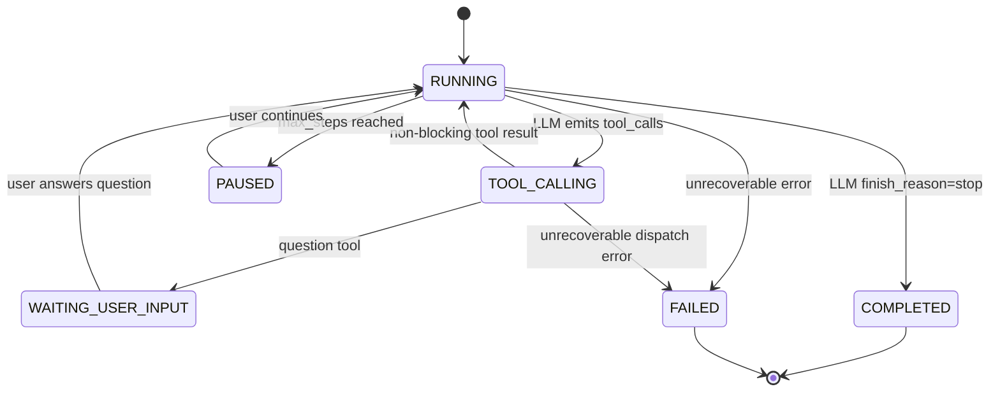

# Agent Loop 与内置 UI 工具设计

> 本文是 `agent-platform` 对话引擎的增量设计，补充现有 `agent-platform/design.md` 中的对话流程、SSE 协议和工具注册表设计。
> 目标是在一次改造中同时完成 Agent Loop、`question` 内置工具和 `todo` 内置工具，避免只做 UI 工具而底层仍是一问一答。

## 1. 背景

当前实现已经有 Agent Loop 的代码雏形，但实际行为仍接近“一问一答”：

| 现状 | 问题 |
| --- | --- |
| `ChatOrchestrator` 有 `for step <= maxSteps` | LLM 调用时传入 `List.of()`，模型拿不到工具定义 |
| `ToolDispatcher` 有 builtin 分支 | builtin 分支只是 TODO stub，没有真实工具语义 |
| SSE 有 `tool_call_start/end` | 没有 `question` 和 `todo` 的结构化事件 |
| 前端能展示通用工具调用 | 无法展示“等待用户选择”的问题卡片，也无法在右侧栏恢复 Todo List |
| OpenAI-compatible streaming 解析 tool calls | 未聚合增量 `arguments`，真实 tool call 流可能不完整 |

本次设计将 `question` 和 `todo` 定义为“内置 UI 工具”。它们不是外部 API 能力，而是 Agent 与前端 UI 协议的一部分：

| 工具 | 阻塞 | 作用 |
| --- | --- | --- |
| `question` | 是 | Agent 暂停执行，向用户提出带选项的问题，用户选择后继续 Agent Loop |
| `todo` | 否 | Agent 创建或更新任务清单，右侧信息栏实时显示并随 SSE 增量更新 |

## 2. 目标与非目标

### 2.1 目标

- 用户发送一条消息后，后端启动一次 Agent Run，而不是固定一问一答。
- Agent 每一步自主决定继续推理、调用工具、等待用户或结束本轮对话。
- `todo` 工具可以在运行中多次更新右侧 Todo List，不中断 Agent Run。
- `question` 工具可以让 Agent 暂停，前端展示选项卡片，用户选择后恢复同一个 Agent Run。
- 达到 `maxSteps` 时暂停并返回可继续状态，保留现有最大步骤数能力。
- SSE 事件、消息持久化和断线重连都能恢复 `question/todo` UI 状态。

### 2.2 非目标

- 不在本次引入 WebFlux，继续使用 Spring MVC `SseEmitter`。
- 不新增独立工作流引擎，Agent Run 仍由 `ChatOrchestrator` 编排。
- 不实现复杂多 Agent 协作；协作 Agent 后续可作为普通工具或引用能力接入。
- 不把 `question/todo` 暴露为用户可删除的普通 MCP 工具。

## 3. Agent Run 状态机



| 状态 | 服务端行为 | 前端表现 |
| --- | --- | --- |
| `RUNNING` | 持续调用 LLM，发送 token / tool events | 输入框 loading，消息流式输出 |
| `TOOL_CALLING` | 调用 ToolDispatcher 或内置工具 | 工具执行卡片显示 running |
| `WAITING_USER_INPUT` | 保存 `session_state`，关闭 SSE | 显示 `question` 卡片，输入框可禁用或允许新消息 |
| `COMPLETED` | 持久化 assistant message，发送 `message_end` | 结束 loading，显示复制/重新生成 |
| `PAUSED` | 保存 `session_state`，发送 `step_limit` | 展示“继续执行/调整步骤上限” |
| `FAILED` | 发送 error，持久化 incomplete | 展示错误 |

## 4. 工具语义

### 4.1 `todo` 工具

`todo` 是非阻塞工具。Agent 调用后，后端校验参数、更新本轮 run 的 Todo State、发送 `todo_updated` SSE，然后立即向 LLM 返回成功结果，Agent Loop 继续。

建议 schema：

```json
{
  "type": "object",
  "properties": {
    "title": {
      "type": "string",
      "description": "Todo list title shown in the right context panel"
    },
    "items": {
      "type": "array",
      "items": {
        "type": "object",
        "properties": {
          "id": {
            "type": "string",
            "description": "Stable item id. Reuse the same id when updating an existing item"
          },
          "title": { "type": "string" },
          "status": {
            "type": "string",
            "enum": ["pending", "in_progress", "completed", "blocked"]
          },
          "detail": { "type": "string" }
        },
        "required": ["id", "title", "status"]
      }
    }
  },
  "required": ["items"]
}
```

合并规则：

| 输入 | 服务端处理 |
| --- | --- |
| 新 `id` | 追加到 Todo List |
| 已存在 `id` | 按字段更新该项 |
| 缺少 `title` 但已有项 | 保留旧 title |
| 空 `items` | 返回 validation error，不更新 UI |

### 4.2 `question` 工具

`question` 是阻塞工具。Agent 调用后，后端发送 `question` SSE，保存恢复上下文，然后暂停本次 SSE。用户点击选项后，调用 answer 接口恢复 Agent Loop。

建议 schema：

```json
{
  "type": "object",
  "properties": {
    "question": {
      "type": "string",
      "description": "The question shown to the user"
    },
    "options": {
      "type": "array",
      "minItems": 1,
      "maxItems": 6,
      "items": {
        "type": "object",
        "properties": {
          "id": { "type": "string" },
          "label": { "type": "string" },
          "description": { "type": "string" }
        },
        "required": ["id", "label"]
      }
    },
    "allow_free_text": {
      "type": "boolean",
      "default": false
    },
    "multi_select": {
      "type": "boolean",
      "default": false
    }
  },
  "required": ["question", "options"]
}
```

恢复时注入给 LLM 的 tool result：

```json
{
  "question_id": "q_xxx",
  "selected_option_ids": ["management"],
  "answer_text": "管理层汇报",
  "answered_at": "2026-05-07T12:00:00+08:00"
}
```

## 5. LLM Tool Calling 协议

### 5.1 tools 注入

每次调用 LLM 时，`ChatOrchestrator` 构造工具列表：

```text
effective_tools = builtin_ui_tools(question, todo)
                + agent_tool_bindings(enabled=true)
                + knowledge/tools derived from agent config
```

`question/todo` 默认对所有 Agent 可用，不要求写入 `agent_tool_bindings`。原因是它们属于平台对话协议能力，而不是用户选择的外部工具能力。

### 5.2 OpenAI-compatible tools 格式

后端传给 `/chat/completions` 的 `tools`：

```json
{
  "type": "function",
  "function": {
    "name": "todo",
    "description": "Create or update the visible todo list for the current agent run.",
    "parameters": { "...": "json schema" }
  }
}
```

MCP 和知识库工具使用已有 `tool_schema_snapshot` 转成同样结构。

### 5.3 streaming tool call 聚合

OpenAI-compatible streaming 可能按 chunk 增量返回：

```json
{
  "choices": [{
    "delta": {
      "tool_calls": [{
        "index": 0,
        "id": "call_x",
        "function": {
          "name": "todo",
          "arguments": "{\"items\":["
        }
      }]
    }
  }]
}
```

实现要求：

| 字段 | 处理 |
| --- | --- |
| `tool_calls[index].id` | 按 index 聚合，首次出现保存 |
| `function.name` | 按 index 聚合，首次出现保存 |
| `function.arguments` | 字符串追加，直到 finish |
| `finish_reason=tool_calls` | 产出完整 `LlmChunk.ToolCallChunk` 列表 |

### 5.4 Assistant tool calls 消息

下一轮 LLM 调用必须包含 assistant tool_calls 消息和 tool result 消息，否则部分模型会拒绝或忽略工具结果。

建议扩展 `LlmMessage`：

```java
record LlmMessage(
    String role,
    String content,
    List<LlmToolCall> toolCalls,
    Map<String, Object> toolResult
)
```

上下文顺序：

```text
user: 帮我生成报告
assistant: tool_calls=[todo(...)]
tool: tool_call_id=call_todo, content={...}
assistant: tool_calls=[question(...)]
tool: tool_call_id=call_question, content={用户选择...}
assistant: 根据你的选择，我继续生成...
```

## 6. SSE 协议

保留现有事件：

| 事件 | 用途 |
| --- | --- |
| `message_start` | 本轮 assistant message 开始 |
| `token` | 文本增量 |
| `tool_call_start` | 任意工具调用开始 |
| `tool_call_end` | 任意工具调用结束 |
| `step_limit` | 达到步骤上限 |
| `message_end` | Agent 自主结束本轮 |
| `error` | 错误 |
| `heartbeat` | 心跳 |

新增事件：

| 事件 | 用途 |
| --- | --- |
| `todo_updated` | 右侧 Todo List 创建或更新 |
| `question` | 消息流展示问题卡片并暂停 |
| `run_status` | 可选，显式传递 `running/waiting_user_input/completed/paused/failed` |

### 6.1 `todo_updated`

```json
{
  "request_id": "req_x",
  "message_id": "msg_x",
  "tool_call_id": "call_todo",
  "title": "生成 Q3 复盘报告",
  "items": [
    {
      "id": "collect_data",
      "title": "收集 Q3 销售数据",
      "status": "completed",
      "detail": "已完成 · 3,240 条记录"
    }
  ],
  "timestamp": "2026-05-07T12:00:00+08:00"
}
```

### 6.2 `question`

```json
{
  "request_id": "req_x",
  "message_id": "msg_x",
  "tool_call_id": "call_question",
  "session_state_id": "state_x",
  "question_id": "q_x",
  "question": "这份 Q3 复盘报告要优先面向谁？",
  "options": [
    {
      "id": "management",
      "label": "管理层汇报",
      "description": "突出结论、风险和决策建议"
    }
  ],
  "allow_free_text": false,
  "multi_select": false,
  "timestamp": "2026-05-07T12:00:00+08:00"
}
```

### 6.3 事件终止规则

| 终止场景 | 最后事件 | SSE 连接 |
| --- | --- | --- |
| Agent 自主完成 | `message_end` | complete |
| question 等待用户 | `question` 后可追加 `run_status(waiting_user_input)` | complete |
| step limit | `step_limit` | complete |
| 不可恢复错误 | `error` | complete |

## 7. API 设计

### 7.1 用户回答 question

```http
POST /api/v1/chat/sessions/{sessionId}/questions/{sessionStateId}/answer
Accept: text/event-stream
Content-Type: application/json
```

请求体：

```json
{
  "questionId": "q_x",
  "selectedOptionIds": ["management"],
  "answerText": "管理层汇报"
}
```

响应：SSE Stream，继续同一个 Agent Run。

校验规则：

| 条件 | 失败处理 |
| --- | --- |
| `sessionStateId` 不属于当前 session | `CHAT_SESSION_NOT_FOUND` |
| state 已过期 | `CHAT_SESSION_STATE_EXPIRED` |
| `questionId` 与 state 中保存的不一致 | `INVALID_REQUEST` |
| 选择项不在 options 中 | `INVALID_REQUEST` |
| `multi_select=false` 但多个选择 | `INVALID_REQUEST` |
| `allow_free_text=false` 但仅传自由文本 | `INVALID_REQUEST` |

### 7.2 继续 step_limit

保留现有接口：

```http
POST /api/v1/chat/sessions/{sessionId}/continue
Accept: text/event-stream
```

`continue` 只用于 max_steps 暂停恢复；`question answer` 用独立接口，避免前端混淆用户选择和普通继续执行。

## 8. 后端组件设计

### 8.1 新增或调整组件

| 组件 | 位置 | 职责 |
| --- | --- | --- |
| `BuiltinUiToolDefinitions` | `common-core` | 提供 `question/todo` 名称、描述、schema |
| `LlmToolSpecFactory` | `ap-module-chat` | 将 builtin/binding schema 转成 OpenAI-compatible `tools` |
| `BuiltinToolExecutor` | `ap-module-chat` | 执行 `question/todo` 参数校验和结果封装 |
| `AgentRunContext` | `ap-module-chat` | 保存本轮运行上下文、todo state、tool records、usage |
| `QuestionAnswerRequest` | `ap-module-chat dto` | question answer 接口请求体 |
| `SseEventBuilder` | `ap-module-chat sse` | 增加 `todoUpdated`、`question`、可选 `runStatus` |
| `OpenAiCompatibleLlmStreamService` | `ap-app` | 修复 streaming tool call 聚合 |

### 8.2 ChatOrchestrator 主循环

伪代码：

```text
start run
send message_start
context = build_context(session)
tools = build_effective_tools(agent)

while step < max_steps:
  chunks = llm.stream(model, context, tools)
  collect tokens and tool calls

  if stream returns text only and finish_reason=stop:
    persist complete assistant message
    send message_end
    return

  if stream returns tool calls:
    append assistant tool_calls message to context
    for each tool_call:
      send tool_call_start
      result = dispatch tool

      if tool is todo:
        update todo state
        send todo_updated
        send tool_call_end(success)
        append tool result to context
        continue

      if tool is question:
        state_id = save context + pending question + todo state
        send question
        send tool_call_end(requires_action)
        persist incomplete assistant message
        complete emitter
        return

      for normal tool:
        send tool_call_end
        append tool result to context
        continue

  step++

save step_limit state
send step_limit
persist incomplete assistant message
```

### 8.3 ToolDispatcher 返回类型

现有 `ToolResult.status` 只有字符串。为了表达 `question` 暂停，建议扩展为稳定状态：

| status | 含义 |
| --- | --- |
| `success` | 工具完成，Agent Loop 继续 |
| `error` | 工具失败，错误注入上下文，Agent Loop 可继续 |
| `requires_action` | 需要用户操作，Agent Run 暂停 |

如果不想立即改 record 结构，可先沿用字符串 status，但前后端必须统一小写值。

### 8.4 持久化策略

不新增表，复用现有 JSONB 字段：

| 字段 | 存储 |
| --- | --- |
| `chat_messages.tool_calls` | 所有 tool call 原始记录，包含 builtin/mcp/knowledge |
| `chat_messages.tool_results` | 工具结果、`todo_state`、`question_state` |
| `chat_session_states.context_snapshot` | 恢复所需 LLM messages |
| `chat_session_states.tool_cache` | `pending_question`、`todo_state`、`message_id`、`request_id` |

`tool_cache` 示例：

```json
{
  "resume_reason": "question",
  "message_id": "msg_x",
  "pending_question": {
    "question_id": "q_x",
    "tool_call_id": "call_question",
    "question": "...",
    "options": []
  },
  "todo_state": {
    "title": "生成 Q3 复盘报告",
    "items": []
  }
}
```

## 9. 前端设计

### 9.1 类型扩展

`frontend/src/api/types.ts` 增加：

```ts
export type TodoStatus = 'pending' | 'in_progress' | 'completed' | 'blocked'

export interface TodoItem {
  id: string
  title: string
  status: TodoStatus
  detail?: string
}

export interface SseTodoUpdated extends SseEventBase {
  tool_call_id: string
  title?: string
  items: TodoItem[]
}

export interface QuestionOption {
  id: string
  label: string
  description?: string
}

export interface SseQuestion extends SseEventBase {
  tool_call_id: string
  session_state_id: string
  question_id: string
  question: string
  options: QuestionOption[]
  allow_free_text?: boolean
  multi_select?: boolean
}
```

### 9.2 ChatPage 状态

`LocalMessage` 增加：

```ts
interface LocalMessage {
  id: string
  backendId?: string
  questions?: QuestionCardState[]
  todoState?: TodoState
}
```

页面级状态：

```ts
const [activeTodo, setActiveTodo] = useState<TodoState | null>(null)
const [pendingQuestion, setPendingQuestion] = useState<QuestionCardState | null>(null)
```

### 9.3 UI 组件

| 组件 | 展示位置 | 行为 |
| --- | --- | --- |
| `QuestionCard` | assistant message 内 | 展示问题、选项、等待状态；点击选项后调用 answer SSE |
| `TodoPanel` | 右侧信息栏 | 展示 title、进度、任务状态、blocked 项高亮 |
| `ToolCallCard` | 现有消息内工具卡片 | 继续展示所有工具；`question/todo` 可简化显示 |

### 9.4 SSE 处理

新增事件处理：

| SSE | 前端处理 |
| --- | --- |
| `message_start` | 记录 backend `message_id` 到当前 assistant message |
| `todo_updated` | 更新当前 message 的 todoState 和右侧 `activeTodo` |
| `question` | 给当前 assistant message 添加 QuestionCard，设置 `pendingQuestion`，停止 sending |
| `tool_call_end` | 统一判断小写 `success/error/requires_action` |
| `message_end` | 清理 pending 状态，标记 completed |

### 9.5 历史恢复

加载历史消息时：

1. 解析 `tool_results`。
2. 如果存在最新 `todo_state`，恢复右侧 TodoPanel。
3. 如果存在未回答 `question_state` 且 message status 是 `incomplete`，恢复 QuestionCard。
4. 如果 message 已 complete，QuestionCard 显示已选择结果，不允许重复提交。

## 10. 兼容性与迁移

| 项 | 策略 |
| --- | --- |
| 数据库 | 不新增表，复用 JSONB 字段；无需 Flyway migration |
| 旧消息 | 没有 `todo_state/question_state` 时按现有逻辑渲染 |
| 旧 Agent | 自动获得 `question/todo`，无需修改 agent_tool_bindings |
| 前端旧工具事件 | 继续支持 `tool_call_start/end` |
| 最大步骤数 | 保持现有 `step_limit` 行为 |

## 11. 测试策略

### 11.1 后端单元测试

| 测试对象 | 场景 |
| --- | --- |
| `BuiltinUiToolDefinitions` | `question/todo` schema 符合 OpenAI-compatible function parameters |
| `LlmToolSpecFactory` | 默认注入 builtin UI tools，追加 agent bindings |
| `OpenAiCompatibleLlmStreamService` | tool call arguments 跨多个 chunk 能正确聚合 |
| `ChatOrchestrator` | todo 调用后发送 `todo_updated` 并继续 loop |
| `ChatOrchestrator` | question 调用后发送 `question`，保存 state，暂停 SSE |
| `ChatOrchestrator` | answer question 后恢复 context 并继续 loop |
| `SseEventBuilder` | 新事件字段、event id、JSON 序列化正确 |

### 11.2 前端验证

| 测试对象 | 场景 |
| --- | --- |
| `ChatPage` | 接收 `todo_updated` 后右侧栏显示进度和任务 |
| `ChatPage` | 接收 `question` 后消息内显示选项卡片 |
| `ChatPage` | 用户选择选项后继续消费 SSE |
| `ChatPage` | 历史消息恢复 Todo 和未完成 Question |
| 类型检查 | `npm run build` 通过 |

### 11.3 端到端测试

用可控 stub LLM 模拟以下序列：

```text
message_start
tool_call(todo)
todo_updated
tool_result(todo)
tool_call(question)
question
user_answer
tool_result(question)
token*
message_end
```

验收点：

- 用户只发送一次初始消息，Agent 可自主执行多步。
- `todo` 右侧栏在 message_end 前已出现。
- `question` 暂停后 SSE 正常 complete，用户选择后继续生成。
- 达到 `maxSteps` 时不丢失 Todo 和上下文。

## 12. 实施顺序

建议按以下顺序实现：

1. 修复工具协议基础：tools 注入、OpenAI streaming tool call 聚合、assistant tool_calls 上下文。
2. 实现 `todo`：后端 schema、执行、`todo_updated` SSE、前端 TodoPanel。
3. 实现 `question`：后端暂停状态、answer 接口、前端 QuestionCard。
4. 补齐历史恢复、断线重连和 step_limit resume 中的 `tool_cache`。
5. 修正现有前端工具状态大小写问题，并补单元测试。
6. 执行 `./mvnw clean verify` 与 `npm run build`。

## 13. 待确认事项

| 问题 | 建议默认值 |
| --- | --- |
| `question` 是否允许自由文本 | MVP 默认 false，后续按 schema 开启 |
| `question` 是否允许多选 | MVP 支持 schema，但 UI 先按单选实现 |
| 右侧 Todo 是否跨 assistant message 保留 | 默认显示当前会话最新 Todo List |
| 用户等待 question 时是否还能输入新消息 | MVP 禁用输入框，只允许回答卡片，避免上下文分叉 |
| `todo` 是否允许用户手动编辑 | MVP 只读，由 Agent 更新 |

