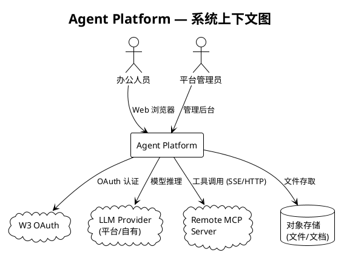
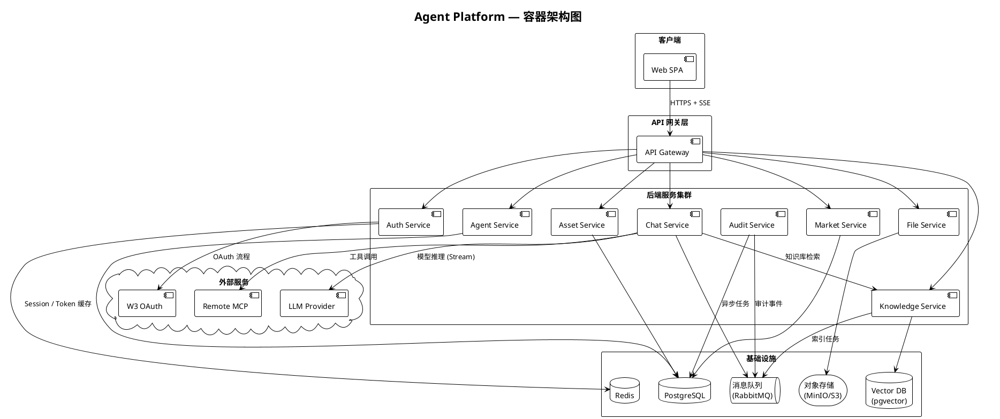
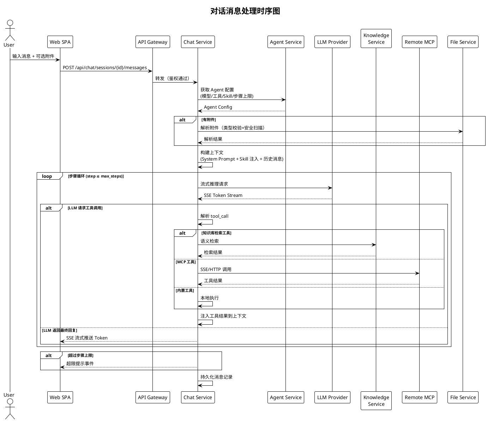
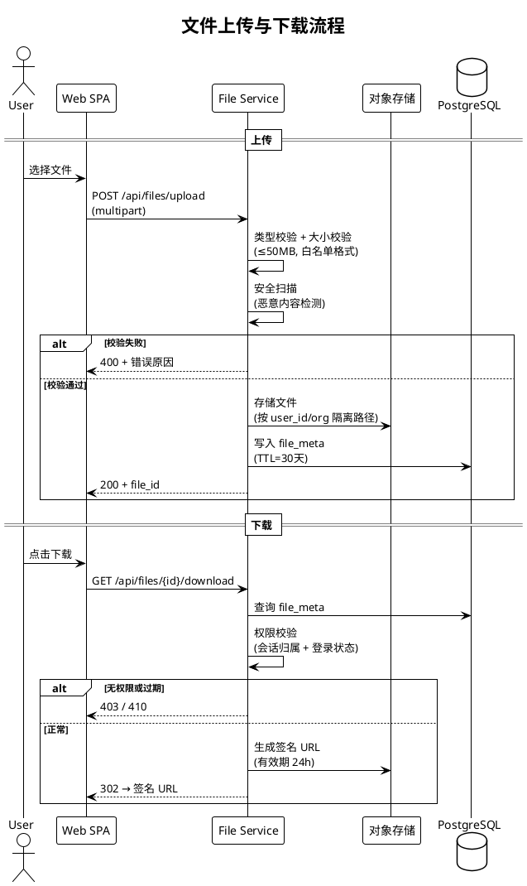
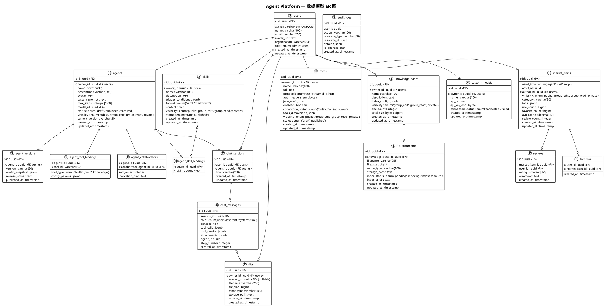
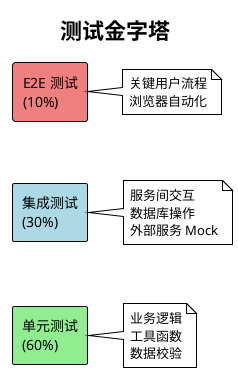

# Agent Platform — 后端设计文档

> 本文配套 `requirements.md` 与 `uiux-design.md` 使用，面向后端开发工程师。
> 需求条款引用格式：R{需求编号}-{条目号}，如 "R1-3" 表示 "需求 1 第 3 条"。

---

## 目录

1. [概述](#1-概述)
2. [架构](#2-架构)
3. [组件和接口](#3-组件和接口)
4. [数据模型](#4-数据模型)
5. [错误处理](#5-错误处理)
6. [测试策略](#6-测试策略)

---

## 1. 概述

### 1.1 产品背景

Agent Platform 是面向非编码场景办公人员的 Web 智能体对话平台。用户通过与在线 Agent 对话完成 Excel 处理、PPT 生成、文档编写等办公任务。平台提供四类核心资产（Agent / Skill / MCP / 知识库）的全生命周期管理，以及公开市场的发布与发现能力。

### 1.2 后端职责范围

| 职责 | 说明 |
| --- | --- |
| **认证与授权** | W3 OAuth 集成、会话管理、RBAC 权限控制（R10） |
| **资产管理** | Agent / Skill / MCP / 知识库的 CRUD、版本控制、可见性管理（R2-R8） |
| **对话引擎** | 消息路由、流式响应、工具调度、步骤控制（R1） |
| **市场服务** | 发布、发现、收藏、评价、使用统计（R3/R5/R7） |
| **文件服务** | 上传/下载、安全扫描、TTL 管理、权限隔离（R1-6~R1-9, R12） |
| **知识库引擎** | 文档解析、向量索引、语义检索（R8） |
| **安全与审计** | 凭据加密、权限隔离、操作审计日志（R12） |

### 1.3 设计约束

- Web Desktop 优先，API 需兼顾未来移动端对话场景
- 企业内网部署，W3 OAuth 为唯一认证入口
- Agent 对话需支持流式响应（SSE）
- 文件保留 30 天，下载链接 24 小时有效
- 敏感凭据（API Key / MCP Token）加密存储，接口和日志中不可出现明文

---

## 2. 架构

### 2.1 系统上下文



### 2.2 容器架构



### 2.3 服务职责说明

| 服务 | 职责 | 对应需求 |
| --- | --- | --- |
| **Auth Service** | W3 OAuth 流程、JWT 签发/刷新、RBAC 鉴权 | R10 |
| **Agent Service** | Agent CRUD、版本管理、配置导入导出 | R2 |
| **Chat Service** | 对话会话管理、消息路由、流式推理、工具调度、步骤控制 | R1 |
| **Market Service** | 市场发布/下架、搜索发现、收藏、评价、使用统计 | R3, R5, R7 |
| **Asset Service** | Skill / MCP / 知识库 CRUD、可见性管理、统一权限校验 | R4, R6, R8, R11 |
| **File Service** | 文件上传/下载、安全扫描、签名 URL、TTL 清理 | R1-6~R1-9, R12 |
| **Knowledge Service** | 文档解析、分片、向量化、索引管理、语义检索 | R8 |
| **Audit Service** | 操作审计日志采集与存储 | R12 |

### 2.4 对话流程时序



### 2.5 文件上传与下载流程



---

## 3. 组件和接口

### 3.1 API 总体规范

| 项目 | 规范 |
| --- | --- |
| 协议 | HTTPS |
| 数据格式 | JSON（请求/响应），SSE（流式对话） |
| 认证 | Bearer JWT（Access Token + Refresh Token） |
| 版本管理 | URL 前缀 `/api/v1/` |
| 分页 | `?page=1&page_size=20`，响应含 `total` |
| 排序 | `?sort_by=created_at&sort_order=desc` |
| 错误格式 | `{ "error": { "code": "ERR_XXX", "message": "...", "details": {} } }` |

### 3.2 Auth Service 接口

#### 3.2.1 OAuth 认证流程（R10-1 ~ R10-4）

```
GET  /api/v1/auth/login
     → 302 重定向到 W3 OAuth 授权页

GET  /api/v1/auth/callback?code={code}&state={state}
     → 200 { access_token, refresh_token, expires_in, user }

POST /api/v1/auth/refresh
     Body: { refresh_token }
     → 200 { access_token, refresh_token, expires_in }

POST /api/v1/auth/logout
     → 200 + 清除服务端 Session
```

#### 3.2.2 用户管理（R10-9 ~ R10-10，仅管理员）

```
GET    /api/v1/admin/users?page&page_size&search
       → 200 { data: [User], total }

PUT    /api/v1/admin/users/{id}/role
       Body: { role: "admin" | "user" }
       → 200

POST   /api/v1/admin/users/sync-w3
       → 200 { synced_count }
```

### 3.3 Agent Service 接口

#### 3.3.1 Agent CRUD（R2-1 ~ R2-12）

```
POST   /api/v1/agents
       Body: AgentCreateRequest
       → 201 { id, ...AgentDetail }

GET    /api/v1/agents?page&page_size&status&search&sort_by
       → 200 { data: [AgentSummary], total }

GET    /api/v1/agents/{id}
       → 200 AgentDetail

PUT    /api/v1/agents/{id}
       Body: AgentUpdateRequest
       → 200 AgentDetail

DELETE /api/v1/agents/{id}
       → 204

POST   /api/v1/agents/{id}/duplicate
       → 201 { id, name: "{原名}-副本" }

GET    /api/v1/agents/{id}/export
       → 200 application/json（配置文件下载）

POST   /api/v1/agents/import
       Body: multipart (JSON 文件)
       → 201 { id, ...AgentDetail }
```

**AgentCreateRequest**:

```json
{
  "name": "string (≤30)",
  "description": "string (≤200)",
  "avatar": "string (url | preset_id)",
  "system_prompt": "string",
  "max_steps": "integer (1-50, default 10)",
  "model_id": "string (平台模型 ID 或自定义模型 ID)",
  "tool_ids": ["string"],
  "skill_ids": ["string"],
  "knowledge_base_ids": ["string"],
  "collaborator_agent_ids": ["string"]
}
```

#### 3.3.2 Agent 版本管理（R3-8, R3-9）

```
GET    /api/v1/agents/{id}/versions
       → 200 { data: [AgentVersion] }

POST   /api/v1/agents/{id}/versions/{version_id}/rollback
       → 200 AgentDetail
```

### 3.4 Chat Service 接口

#### 3.4.1 对话会话管理（R1-1 ~ R1-14）

```
POST   /api/v1/chat/sessions
       Body: { agent_id }
       → 201 { session_id, agent, created_at }

GET    /api/v1/chat/sessions?page&page_size
       → 200 { data: [SessionSummary], total }

GET    /api/v1/chat/sessions/{id}
       → 200 SessionDetail (含消息历史)

DELETE /api/v1/chat/sessions/{id}
       → 204（清空对话, R1-12）
```

#### 3.4.2 消息发送与流式响应（R1-3 ~ R1-5）

```
POST   /api/v1/chat/sessions/{id}/messages
       Body: { content, attachments?: [file_id] }
       Headers: Accept: text/event-stream
       → SSE Stream

       SSE 事件类型:
       event: message_start    data: { message_id }
       event: token            data: { delta: "..." }
       event: tool_call_start  data: { tool_name, tool_id, arguments }
       event: tool_call_end    data: { tool_id, result, status }
       event: message_end      data: { message_id, usage }
       event: step_limit       data: { current, max, message }
       event: error            data: { code, message }
```

#### 3.4.3 消息操作（R1-10, R1-14）

```
POST   /api/v1/chat/sessions/{id}/messages/{msg_id}/regenerate
       Headers: Accept: text/event-stream
       → SSE Stream（替换原消息）

PUT    /api/v1/chat/sessions/{id}/agent
       Body: { agent_id }
       → 200 { separator_message }（切换智能体, R1-14）

POST   /api/v1/chat/sessions/{id}/continue
       → SSE Stream（继续执行, R1-13）
```

### 3.5 Market Service 接口

#### 3.5.1 发布管理（R3, R5, R7 发布部分）

统一发布接口，适用于 Agent / Skill / MCP 三类资产：

```
POST   /api/v1/market/publish
       Body: {
         asset_type: "agent" | "skill" | "mcp",
         asset_id: "string",
         visibility: "public" | "group_edit" | "group_read" | "private",
         version: "string",
         release_notes: "string"
       }
       → 200 { market_item_id, version }

PUT    /api/v1/market/items/{id}/visibility
       Body: { visibility }
       → 200
```

#### 3.5.2 市场浏览与搜索（R3-4, R5-1, R7-1 ~ R7-3）

```
GET    /api/v1/market/items?type&category&search&sort_by&page&page_size
       → 200 { data: [MarketItem], total }

GET    /api/v1/market/items/{id}
       → 200 MarketItemDetail

GET    /api/v1/market/featured?type
       → 200 { data: [MarketItem] }（首页精选）
```

#### 3.5.3 收藏与评价（R3-7, R5-6）

```
POST   /api/v1/market/items/{id}/favorite
       → 200

DELETE /api/v1/market/items/{id}/favorite
       → 204

POST   /api/v1/market/items/{id}/reviews
       Body: { rating: 1-5, comment: "string" }
       → 201

GET    /api/v1/market/items/{id}/reviews?page&page_size
       → 200 { data: [Review], average_rating, total }
```

#### 3.5.4 市场资产导入（R5-3, R7-4）

```
POST   /api/v1/market/items/{id}/import
       Body: { auth_config?: {} }（MCP 可能需要认证配置, R7-4, R7-5）
       → 201 { asset_id }
```

### 3.6 Asset Service — Skill 接口

#### 3.6.1 Skill CRUD（R4-1 ~ R4-7）

```
POST   /api/v1/skills
       Body: SkillCreateRequest
       → 201

GET    /api/v1/skills?page&page_size&search
       → 200 { data: [SkillSummary], total }

GET    /api/v1/skills/{id}
       → 200 SkillDetail

PUT    /api/v1/skills/{id}
       Body: SkillUpdateRequest
       → 200

DELETE /api/v1/skills/{id}
       → 204

GET    /api/v1/skills/{id}/export
       → 200 application/json
```

**SkillCreateRequest**:

```json
{
  "name": "string",
  "description": "string",
  "trigger_conditions": ["string"],
  "format": "yaml | markdown",
  "content": "string (Skill 定义内容)"
}
```

### 3.7 Asset Service — MCP 接口

#### 3.7.1 MCP CRUD（R6-1 ~ R6-8）

```
POST   /api/v1/mcps
       Body: McpCreateRequest
       → 201

GET    /api/v1/mcps?page&page_size&search
       → 200 { data: [McpSummary], total }

GET    /api/v1/mcps/{id}
       → 200 McpDetail

PUT    /api/v1/mcps/{id}
       → 200

DELETE /api/v1/mcps/{id}
       → 204（同步销毁加密凭据, R12-3）

PUT    /api/v1/mcps/{id}/toggle
       Body: { enabled: boolean }
       → 200（R6-7）

POST   /api/v1/mcps/{id}/test
       → 200 { status, tools_count, tools: [...], error? }（R6-5）
```

**McpCreateRequest**:

```json
{
  "name": "string",
  "url": "string",
  "protocol": "sse | streamable_http",
  "auth_headers": { "key": "encrypted_value" },
  "json_config": "string (可选, JSON 配置方式)"
}
```

### 3.8 Asset Service — 知识库接口

#### 3.8.1 知识库 CRUD（R8-1 ~ R8-8）

```
POST   /api/v1/knowledge-bases
       Body: { name, description, index_config? }
       → 201

GET    /api/v1/knowledge-bases?page&page_size
       → 200 { data: [KnowledgeBaseSummary], total }

GET    /api/v1/knowledge-bases/{id}
       → 200 KnowledgeBaseDetail

PUT    /api/v1/knowledge-bases/{id}
       → 200

DELETE /api/v1/knowledge-bases/{id}
       → 204
```

#### 3.8.2 文档管理（R8-3 ~ R8-5）

```
POST   /api/v1/knowledge-bases/{id}/documents
       Body: multipart (文件上传)
       → 202 { document_id, status: "indexing" }

GET    /api/v1/knowledge-bases/{id}/documents?page&page_size
       → 200 { data: [Document], total }

DELETE /api/v1/knowledge-bases/{id}/documents/{doc_id}
       → 204

POST   /api/v1/knowledge-bases/{id}/documents/{doc_id}/reindex
       → 202（R8-8 重试索引）
```

#### 3.8.3 语义检索（R8-6）

```
POST   /api/v1/knowledge-bases/{id}/search
       Body: { query, top_k: 5 }
       → 200 { results: [{ content, score, document_name, page }] }
```

### 3.9 File Service 接口

#### 3.9.1 文件操作（R1-6 ~ R1-9, R12）

```
POST   /api/v1/files/upload
       Body: multipart
       → 200 { file_id, filename, size, mime_type }

GET    /api/v1/files/{id}/download
       → 302 (签名 URL) | 403 | 410

GET    /api/v1/files/{id}/preview
       → 200（PDF/Excel/图片在线预览, R1-7）

GET    /api/v1/files/{id}/meta
       → 200 { file_id, filename, size, mime_type, expired, created_at }
```

### 3.10 Model Config 接口

#### 3.10.1 模型管理（R9）

```
GET    /api/v1/models/builtin
       → 200 { data: [BuiltinModel] }

POST   /api/v1/models/custom
       Body: { name, api_url, api_key }
       → 201（验证连通性后保存, R9-3）

GET    /api/v1/models/custom?page&page_size
       → 200 { data: [CustomModel], total }

PUT    /api/v1/models/custom/{id}
       Body: { name?, api_url?, api_key? }
       → 200（重新验证连通性, R9-4）

DELETE /api/v1/models/custom/{id}
       → 200 { affected_agents: [{ id, name }] }（R9-5）

GET    /api/v1/models/all
       → 200 { builtin: [...], custom: [...] }（R9-1 下拉列表用）
```

---

## 4. 数据模型

### 4.1 ER 图



### 4.2 核心实体说明

#### 4.2.1 users

| 字段 | 类型 | 说明 |
| --- | --- | --- |
| id | uuid | 主键 |
| w3_id | varchar(64) | W3 OAuth 用户唯一标识，UNIQUE |
| name | varchar(100) | 用户姓名（从 W3 同步） |
| email | varchar(255) | 邮箱 |
| organization | varchar(200) | W3 组织名称，用于"同组"可见性判定 |
| role | enum | `admin` / `user` |

#### 4.2.2 agents

| 字段 | 类型 | 说明 |
| --- | --- | --- |
| model_id | uuid | 引用 `custom_models.id` 或内置模型标识 |
| max_steps | integer | 每轮对话工具调用步数上限，默认 10，范围 1-50（R2-2） |
| visibility | enum | 四级可见性（R资产可见性模型） |
| current_version | varchar(20) | 当前发布版本号，如 `v1.2.0` |

#### 4.2.3 mcps — 凭据加密存储

- `auth_headers_enc` 使用 AES-256-GCM 加密，密钥由 KMS 管理
- API 响应中仅返回脱敏值（R12-2）
- 删除 MCP 记录时同步销毁加密数据（R12-3）
- 发布到市场时 **不包含** `auth_headers_enc`（R7-2）

#### 4.2.4 files — TTL 与权限

- `expires_at = created_at + 30 days`（R1-8），定时任务扫描清理
- 下载时校验 `owner_id` 与当前会话用户、`session_id` 归属（R1-9）
- 签名 URL 有效期 24 小时

#### 4.2.5 knowledge_bases — 可见性限制

- `visibility` 最高级别为 `group_edit`，不支持 `public`（R 资产可见性模型：知识库不进市场）

### 4.3 索引策略

| 表 | 索引 | 用途 |
| --- | --- | --- |
| agents | `(owner_id, status)` | 用户资产列表 |
| agents | `(visibility, status)` | 市场搜索 |
| agents | GIN `(name, description)` | 全文搜索 |
| chat_sessions | `(user_id, updated_at DESC)` | 会话列表排序 |
| chat_messages | `(session_id, created_at)` | 消息时序查询 |
| market_items | `(asset_type, visibility)` | 市场分类筛选 |
| market_items | GIN `(tags)` | 标签搜索 |
| files | `(expires_at)` | TTL 清理任务 |
| audit_logs | `(user_id, created_at)` | 审计查询 |
| kb_documents | `(knowledge_base_id, index_status)` | 文档管理 |

---

## 5. 错误处理

### 5.1 错误码体系

采用分层错误码设计，格式 `{域}_{类别}_{具体错误}`：

| 错误码 | HTTP 状态码 | 说明 | 对应需求 |
| --- | --- | --- | --- |
| **认证与授权** | | | |
| `AUTH_TOKEN_EXPIRED` | 401 | Access Token 过期 | R10-4 |
| `AUTH_REFRESH_FAILED` | 401 | Refresh Token 无效，需重新登录 | R10-4 |
| `AUTH_FORBIDDEN` | 403 | 无权访问该资源 | R10-7, R12-7 |
| `AUTH_OAUTH_FAILED` | 502 | W3 OAuth 回调失败 | R10-2 |
| **资产操作** | | | |
| `ASSET_NOT_FOUND` | 404 | 资产不存在 | — |
| `ASSET_NAME_DUPLICATE` | 409 | 资产名称重复 | — |
| `ASSET_PERMISSION_DENIED` | 403 | 资产权限不足 | R12-7 |
| `ASSET_DELETE_CONFLICT` | 409 | 资产被引用无法直接删除（含关联信息） | R9-5 |
| `ASSET_VISIBILITY_INVALID` | 400 | 该资产类型不支持该可见性级别 | 资产可见性模型 |
| **Agent 相关** | | | |
| `AGENT_VALIDATION_FAILED` | 400 | Agent 配置校验失败（缺少必填项等） | R2-2 |
| `AGENT_IMPORT_INVALID` | 400 | 导入文件格式不正确 | R2-12 |
| `AGENT_VERSION_CONFLICT` | 409 | 版本号冲突 | R3-8 |
| **对话相关** | | | |
| `CHAT_STEP_LIMIT` | 200 (SSE) | 达到最大步骤数限制 | R1-13 |
| `CHAT_MODEL_ERROR` | 502 | LLM 推理请求失败 | R9-6 |
| `CHAT_TOOL_ERROR` | 200 (SSE) | 工具调用失败（不中断对话） | R1-5 |
| `CHAT_SESSION_NOT_FOUND` | 404 | 会话不存在 | — |
| **MCP 相关** | | | |
| `MCP_CONNECTION_FAILED` | 422 | MCP 连接验证失败 | R6-4, R6-8 |
| `MCP_TOOL_CALL_FAILED` | 502 | MCP 远程工具调用失败 | R6-8 |
| `MCP_PROTOCOL_INVALID` | 400 | 不支持的协议类型 | R6-3 |
| **知识库相关** | | | |
| `KB_INDEX_FAILED` | 500 | 文档索引构建失败 | R8-8 |
| `KB_DOC_TYPE_UNSUPPORTED` | 400 | 不支持的文档格式 | R8-3 |
| `KB_DOC_TOO_LARGE` | 413 | 文档超过大小限制 | R12-4 |
| **文件相关** | | | |
| `FILE_TYPE_REJECTED` | 400 | 文件类型不在白名单 | R12-4 |
| `FILE_SIZE_EXCEEDED` | 413 | 文件超过 50MB 限制 | R12-4 |
| `FILE_SCAN_FAILED` | 422 | 文件安全扫描未通过 | R12-5 |
| `FILE_EXPIRED` | 410 | 文件已过期（超过 30 天） | R1-8 |
| `FILE_LINK_EXPIRED` | 403 | 下载链接已过期（超过 24h） | R1-9 |
| **模型配置** | | | |
| `MODEL_CONNECTION_FAILED` | 422 | 自定义模型 API 连通性验证失败 | R9-3, R9-6 |
| `MODEL_APIKEY_INVALID` | 401 | API Key 无效 | R9-6 |

### 5.2 统一错误响应格式

```json
{
  "error": {
    "code": "FILE_SIZE_EXCEEDED",
    "message": "文件大小超过限制，最大允许 50MB",
    "details": {
      "max_size_bytes": 52428800,
      "actual_size_bytes": 78643200,
      "filename": "large-report.xlsx"
    },
    "request_id": "req_abc123"
  }
}
```

### 5.3 SSE 流式错误处理

对话流式响应中的错误通过 SSE 事件传递，不中断连接（除非致命错误）：

```
event: error
data: {"code":"CHAT_TOOL_ERROR","message":"工具 web_search 执行失败","recoverable":true}

event: error
data: {"code":"CHAT_MODEL_ERROR","message":"模型服务暂时不可用，请稍后重试","recoverable":false}
```

- `recoverable: true` — 工具调用失败，Chat Service 跳过该工具继续推理
- `recoverable: false` — 致命错误，SSE 连接关闭，前端提示用户重试

### 5.4 重试与熔断策略

| 外部依赖 | 重试策略 | 熔断条件 |
| --- | --- | --- |
| LLM Provider | 指数退避，最多 3 次，超时 60s | 连续 5 次失败，熔断 30s |
| Remote MCP | 固定间隔 2s，最多 2 次，超时 30s | 连续 3 次失败，标记 `connection_status=error` |
| W3 OAuth | 不重试，直接返回错误让用户重新操作 | — |
| Vector DB | 指数退避，最多 3 次 | 连续 10 次失败，降级为无知识库模式 |
| 对象存储 | 指数退避，最多 3 次 | — |

### 5.5 审计日志记录规则（R12-审计与合规）

以下敏感操作必须写入 `audit_logs`：

| 操作 | action 值 | 记录详情 |
| --- | --- | --- |
| 创建/删除 API Key | `model.key.create` / `model.key.delete` | 模型名称（不含 Key） |
| 发布/下架资产 | `market.publish` / `market.unpublish` | 资产类型、ID、可见性 |
| 管理员修改权限 | `admin.user.role.update` | 目标用户、旧角色、新角色 |
| MCP 凭据操作 | `mcp.auth.update` / `mcp.auth.delete` | MCP 名称（不含凭据） |
| 越权访问尝试 | `access.denied` | 资源类型、ID、请求者 |

---

## 6. 测试策略

### 6.1 测试金字塔



### 6.2 单元测试（60%）

| 测试对象 | 重点覆盖场景 | 工具 |
| --- | --- | --- |
| 权限校验逻辑 | 四级可见性判定、组织匹配、角色校验 | pytest / Jest |
| Agent 配置校验 | 必填项、max_steps 范围、模型引用有效性 | pytest |
| Skill 格式解析 | YAML/Markdown 解析、触发条件匹配 | pytest |
| 文件安全校验 | 类型白名单、大小限制、MIME 校验 | pytest |
| 凭据加密/脱敏 | AES-256-GCM 加解密正确性、脱敏输出格式 | pytest |
| SSE 事件构建 | 事件类型、数据格式、Token 流拼接 | pytest |
| 步骤计数器 | 正常计数、上限触发、继续执行 | pytest |
| 分页/排序/筛选 | 边界值、空结果、大量数据 | pytest |

### 6.3 集成测试（30%）

| 测试场景 | 覆盖内容 | 依赖处理 |
| --- | --- | --- |
| **OAuth 认证流程** | 登录 → 回调 → Token 签发 → Token 刷新 → 登出 | W3 OAuth Mock Server |
| **Agent 全生命周期** | 创建 → 编辑 → 调试 → 发布 → 版本管理 → 删除 | 真实数据库（TestContainer） |
| **对话流式响应** | 发送消息 → 流式接收 → 工具调用 → 结果回传 | LLM Mock（固定响应） |
| **MCP 连接与调用** | 添加 → 测试连接 → 发现工具 → 对话中调用 | MCP Mock Server |
| **知识库索引与检索** | 上传文档 → 等待索引 → 语义检索验证 | 真实 Vector DB |
| **文件 TTL 管理** | 上传 → 生成链接 → 过期 → 清理 | 时间 Mock |
| **市场发布与发现** | 发布 → 搜索 → 详情 → 接入/导入 | 真实数据库 |
| **权限隔离** | 私有资产跨用户访问 → 403 → 审计日志记录 | 多用户模拟 |

#### 集成测试关键用例

```
[Auth] 
  ✓ OAuth 回调成功签发 JWT
  ✓ Refresh Token 刷新 Access Token
  ✓ 过期 Refresh Token 返回 401
  ✓ 管理员接口非管理员返回 403

[Agent CRUD]
  ✓ 创建 Agent 并验证数据持久化
  ✓ 更新 Agent 配置后绑定关系同步更新
  ✓ 删除 Agent 同步清理工具/Skill 绑定
  ✓ 导入导出 Agent 配置往返一致性
  ✓ 复制 Agent 生成独立副本

[Chat]
  ✓ 完整对话流程（发送 → 流式响应 → 工具调用 → 回复）
  ✓ 达到 max_steps 时正确发送 step_limit 事件
  ✓ 继续执行后步骤计数器正确递增
  ✓ 切换 Agent 后上下文隔离
  ✓ 重新生成替换原消息
  ✓ 并发消息发送幂等性

[MCP]
  ✓ SSE 协议连接与工具发现
  ✓ Streamable HTTP 协议连接与工具发现
  ✓ 连接失败返回错误详情
  ✓ 禁用后对话中不可调用

[Knowledge Base]
  ✓ PDF/Word/Excel 文档解析与索引
  ✓ 索引完成后检索返回相关结果
  ✓ 删除文档后索引同步更新
  ✓ 索引失败后重试成功

[File Security]
  ✓ 超限文件拒绝上传（>50MB）
  ✓ 非白名单类型拒绝上传
  ✓ 非归属用户下载返回 403
  ✓ 过期文件返回 410
  ✓ 签名 URL 24h 后失效

[Market]
  ✓ 发布后市场搜索可发现
  ✓ 下架后市场搜索不可见
  ✓ MCP 发布不含认证凭据
  ✓ 收藏/取消收藏计数正确
  ✓ 评分计算准确

[Audit]
  ✓ 敏感操作均写入审计日志
  ✓ 越权访问触发 access.denied 日志
```

### 6.4 端到端测试（10%）

覆盖 `uiux-design.md` 第 23 节定义的 6 个关键用户流程：

| 流程 | 覆盖路径 | 验证要点 |
| --- | --- | --- |
| **A: 新用户首次创建并使用 Agent** | P01→P02→P03→P05→P06→P04→P15 | 全链路可达，数据一致 |
| **B: 从市场发现并使用 Agent** | P07→P08→P15 | 搜索可用、对话正常 |
| **C: 为 Agent 添加 MCP 工具** | P12→P14→P12→P05→P06 | MCP 接入后 Agent 可调用 |
| **D: 导入/导出 Agent** | P04 导出→P04 导入 | 配置往返一致 |
| **E: 发布与版本更新** | P05 发布→更新→再发布 | 版本号递增、市场可见 |
| **F: 会话过期处理** | 任意页面 401→静默刷新/重登录 | 无感刷新或正确跳转 |

### 6.5 非功能测试

| 测试类型 | 目标 | 方法 |
| --- | --- | --- |
| **性能** | 对话首 Token 延迟 < 2s；API P99 < 500ms | k6 / Locust 压测 |
| **并发** | 支持 500 并发对话会话 | 压力测试 |
| **安全** | 无凭据泄露、无越权访问 | OWASP ZAP 扫描 + 渗透测试 |
| **容错** | LLM/MCP 不可用时优雅降级 | 混沌工程（依赖注入故障） |
| **数据一致性** | 并发操作无数据丢失/错乱 | 并发写入测试 |

### 6.6 测试环境要求

| 环境 | 用途 | 外部依赖处理 |
| --- | --- | --- |
| **Local** | 单元测试 + 轻量集成 | 全 Mock |
| **CI** | 全量单元 + 集成测试 | TestContainer（PG/Redis/MQ）+ Mock Server（W3/LLM/MCP） |
| **Staging** | E2E + 性能测试 | 真实 W3 测试租户 + LLM 沙箱 + 独立 MCP 测试服务 |
