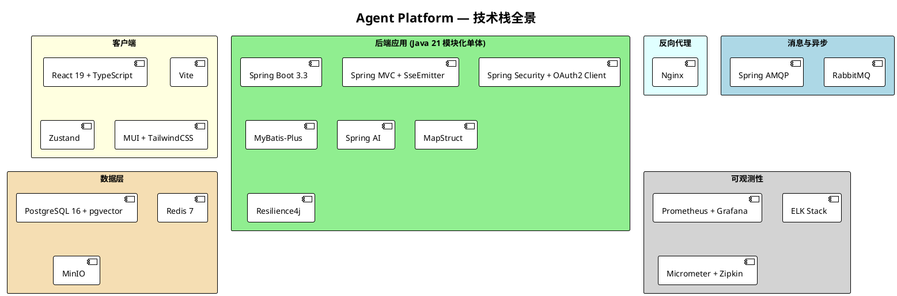
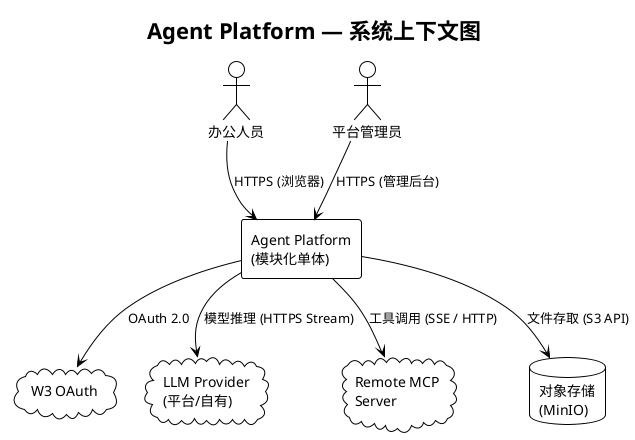
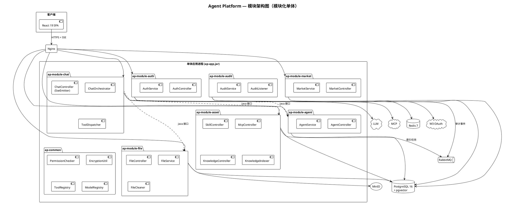
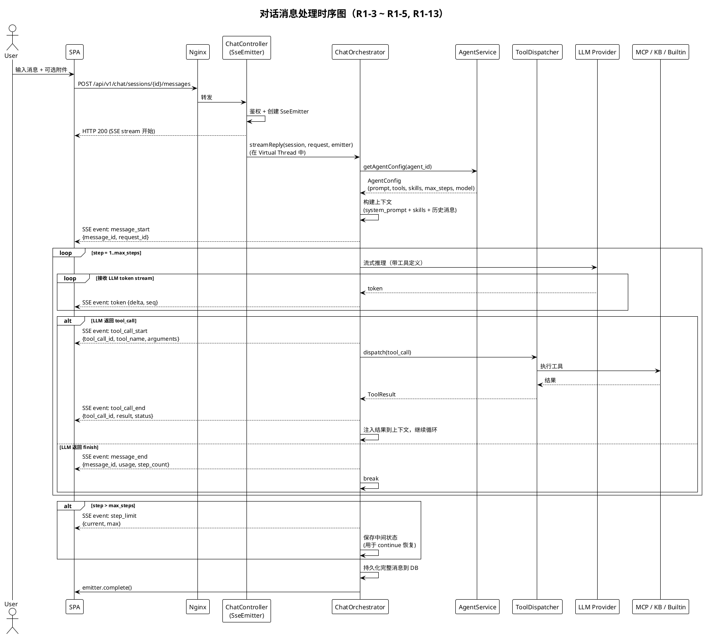
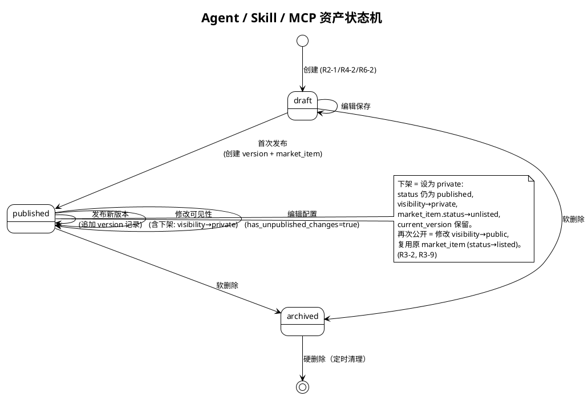
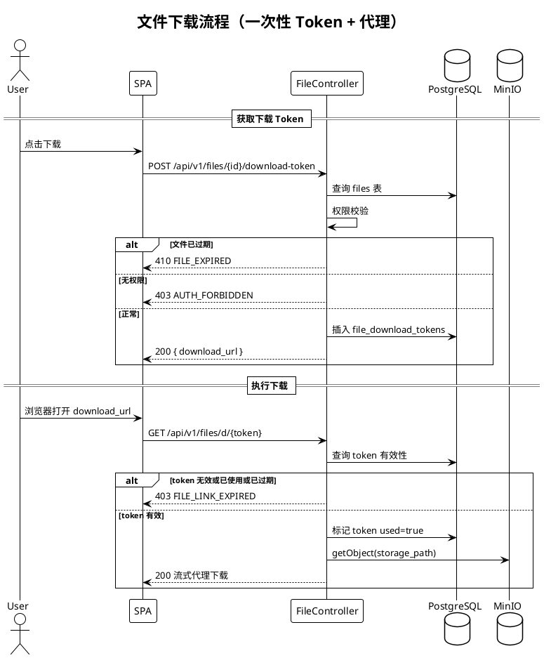
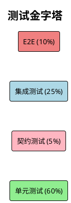

# Agent Platform — 后端设计文档

> 本文配套 `requirements.md` 与 `uiux-design.md` 使用，面向后端开发工程师与测试工程师。
> 需求条款引用格式：R{需求编号}-{条目号}，如 "R1-3" 表示"需求 1 第 3 条"。编号以 `requirements.md` 为唯一权威来源。

---

## 目录

1. [概述](#1-概述)
2. [技术栈](#2-技术栈)
3. [架构](#3-架构)
4. [组件和接口](#4-组件和接口)
5. [数据模型](#5-数据模型)
6. [错误处理](#6-错误处理)
7. [测试策略](#7-测试策略)

---

## 1. 概述

### 1.1 产品背景

Agent Platform 是面向非编码场景办公人员的 Web 智能体对话平台。用户通过与在线 Agent 对话完成 Excel 处理、PPT 生成、文档编写等办公任务。平台提供四类核心资产（Agent / Skill / MCP / 知识库）的全生命周期管理，以及公开市场的发布与发现能力。

### 1.2 后端职责范围


| 职责        | 说明                                         | 对应需求                       |
| --------- | ------------------------------------------ | -------------------------- |
| **认证与授权** | W3 OAuth 集成、会话管理、RBAC 权限控制                 | R10                        |
| **资产管理**  | Agent / Skill / MCP / 知识库的 CRUD、版本控制、可见性管理 | R2, R4, R6, R8, R11        |
| **对话引擎**  | 消息路由、流式响应、工具调度、步骤控制                        | R1                         |
| **市场服务**  | 发布、发现、收藏、评价、使用统计                           | R3, R5, R7                 |
| **文件服务**  | 上传/下载、安全扫描、TTL 管理、权限隔离                     | R1-6 ~ R1-9, R12-4 ~ R12-6 |
| **知识库引擎** | 文档解析、向量索引、语义检索                             | R8                         |
| **安全与审计** | 凭据加密、权限隔离、操作审计日志                           | R12                        |


### 1.3 设计约束

- Web Desktop 优先，API 需兼顾未来移动端对话场景
- 企业内网部署，W3 OAuth 为唯一认证入口
- Agent 对话需支持流式响应（SSE），基于 Spring MVC `SseEmitter`
- 文件保留 30 天（R1-8），下载链接 24 小时有效（R1-9）
- 敏感凭据（API Key / MCP Token）加密存储，接口和日志中不可出现明文（R12-1, R12-2）
- 第一期采用模块化单体部署，按 Maven 模块划分边界，预留微服务拆分路径

### 1.4 需求追溯约定

本文统一以 `requirements.md` 的需求编号为权威来源。对于含子章节的需求（如 R7、R9、R12），采用跨子章节的顺序编号：


| 需求        | 子章节               | 编号范围                                                             |
| --------- | ----------------- | ---------------------------------------------------------------- |
| R7 MCP 市场 | 发现与接入 / 发布        | R7-1 ~ R7-5（发现）、R7-6 ~ R7-8（发布）                                  |
| R9 模型配置   | 智能体内选择 / 自定义管理    | R9-1 ~ R9-2（选择）、R9-3 ~ R9-8（管理）                                  |
| R12 数据安全  | 凭据 / 文件 / 权限 / 审计 | R12-1 ~ R12-3（凭据）、R12-4 ~ R12-6（文件）、R12-7 ~ R12-9（权限）、R12-10（审计） |


> **注意**：`uiux-design.md` 部分页面的 R 编号与 `requirements.md` 存在偏移（如 UI 文档 P04 标注 "R1-6~R1-11" 实际对应 R2-7 ~ R2-12）。后端实现和测试以本文引用的 `requirements.md` 编号为准。

---

## 2. 技术栈

### 2.1 总览



### 2.2 后端核心技术


| 层级           | 技术选型                                     | 版本        | 选型理由                                                                       |
| ------------ | ---------------------------------------- | --------- | -------------------------------------------------------------------------- |
| **语言 & JDK** | Java                                     | 21 (LTS)  | 用户指定；Virtual Threads 天然适配高并发对话场景                                           |
| **框架**       | Spring Boot                              | 3.3.x     | Java 21 原生支持，生态成熟                                                          |
| **Web 层**    | Spring MVC + `SseEmitter`                | 6.x       | **全部端点**均运行在 Servlet 栈上，SSE 通过 `SseEmitter` 实现（详见 §2.8）。**不引入 WebFlux 依赖** |
| **AI 集成**    | Spring AI                                | 1.0.x     | 统一 `ChatClient` 抽象对接 OpenAI / Anthropic / 国产模型，内置 Function Calling 编排      |
| **认证授权**     | Spring Security + OAuth2 Client          | 6.x       | W3 OAuth 集成、JWT 签发/校验、方法级权限注解                                              |
| **ORM**      | MyBatis-Plus                             | 3.5.x     | 灵活 SQL，适合复杂权限过滤与市场搜索；代码生成减少样板                                              |
| **对象映射**     | MapStruct                                | 1.6.x     | 编译期生成，零反射，DTO ↔ Entity 类型安全                                                |
| **参数校验**     | Jakarta Validation (Hibernate Validator) | 3.1 / 8.x | 声明式 `@NotBlank` / `@Size` / `@Range`                                       |
| **API 文档**   | SpringDoc OpenAPI                        | 2.x       | 自动生成 OpenAPI 3.0 + Swagger UI                                              |
| **JSON**     | Jackson                                  | 2.17.x    | Spring Boot 默认，JSONB 序列化                                                   |
| **熔断限流**     | Resilience4j                             | 2.x       | 保护 LLM / MCP 外部调用链路                                                        |


### 2.3 数据层技术


| 组件        | 技术选型       | 版本     | 选型理由                                        |
| --------- | ---------- | ------ | ------------------------------------------- |
| **关系数据库** | PostgreSQL | 16     | JSONB 原生支持；pgvector 扩展实现向量检索，无需独立 Vector DB |
| **向量检索**  | pgvector   | 0.7.x  | 与业务数据同库，事务一致；HNSW 索引满足百万级文档片段检索             |
| **缓存**    | Redis      | 7.x    | Session 缓存、Token 黑名单、热点数据、分布式锁              |
| **对象存储**  | MinIO      | latest | S3 兼容 API，企业内网部署；按用户/组织目录隔离                 |
| **消息队列**  | RabbitMQ   | 3.13.x | 异步任务（知识库索引、文件清理、审计写入）；延迟队列支持 TTL            |


### 2.4 安全技术


| 关注点          | 方案                   | 说明                                    |
| ------------ | -------------------- | ------------------------------------- |
| **凭据加密**     | AES-256-GCM + Jasypt | 密钥通过环境变量注入，不入代码仓库（R12-1, R12-2）       |
| **传输安全**     | TLS 1.3              | Nginx 终止 TLS                          |
| **JWT 签名**   | RS256                | 非对称签名，私钥仅 Auth 模块持有                   |
| **文件安全扫描**   | Apache Tika + ClamAV | Tika 做 MIME 深度校验，ClamAV 恶意内容检测（R12-5） |
| **SQL 注入防护** | MyBatis-Plus 参数化查询   | 框架层面杜绝拼接 SQL                          |
| **接口限流**     | Resilience4j         | 令牌桶限流 + 熔断器                           |


### 2.5 基础设施与 DevOps


| 组件        | 技术选型                        | 用途                       |
| --------- | --------------------------- | ------------------------ |
| **容器化**   | Docker + Docker Compose     | 本地开发与 CI 一键拉起全栈          |
| **反向代理**  | Nginx                       | TLS 终止、静态资源、SSE 长连接代理    |
| **CI/CD** | GitLab CI / GitHub Actions  | 自动构建、测试、镜像推送             |
| **监控**    | Prometheus + Grafana        | JVM 指标、业务指标（对话 QPS、工具延迟） |
| **日志**    | ELK Stack                   | 结构化日志、审计查询、错误追踪          |
| **链路追踪**  | Micrometer Tracing + Zipkin | 跨模块调用链可视化                |


### 2.6 前端技术


| 组件              | 技术选型                                 | 选型理由                                 |
| --------------- | ------------------------------------ | ------------------------------------ |
| **框架**          | React 19 + TypeScript                | Hooks 生态成熟；TypeScript 类型安全           |
| **构建工具**        | Vite 6                               | 极速 HMR                               |
| **UI 组件库**      | MUI (Material UI) 6                  | 企业级组件丰富（DataGrid / Stepper / Dialog） |
| **样式方案**        | TailwindCSS 4                        | 与 MUI 互补：MUI 负责复杂组件，Tailwind 负责布局微调  |
| **状态管理**        | Zustand                              | 极简 API，TypeScript 友好                 |
| **路由**          | React Router 7                       | 嵌套布局支持                               |
| **SSE 客户端**     | @microsoft/fetch-event-source        | 支持 POST + 自定义 Header + 断线重连          |
| **代码编辑器**       | Monaco Editor (@monaco-editor/react) | Skill YAML/Markdown 编辑               |
| **Markdown 渲染** | react-markdown + rehype-highlight    | 对话消息富文本                              |
| **文件预览**        | react-spreadsheet + react-pdf        | R1-7 在线预览                            |


### 2.7 项目工程结构（模块化单体）

第一期采用模块化单体（Modular Monolith），所有模块编译为单一可部署 JAR。模块间通过 Java 接口调用（非 HTTP），共享同一数据库连接池与事务管理器。各模块通过 Maven 模块物理隔离，具备未来拆分为独立服务的能力。

```
agent-platform/
├── ap-app/                          # 启动模块（Spring Boot Application）
│   └── src/main/.../Application.java
├── ap-module-auth/                  # 认证授权模块
├── ap-module-agent/                 # Agent 管理模块
├── ap-module-chat/                  # 对话引擎模块
├── ap-module-market/                # 市场模块
├── ap-module-asset/                 # Skill / MCP / 知识库管理
├── ap-module-file/                  # 文件模块
├── ap-module-audit/                 # 审计模块
├── ap-common/                       # 公共模块
│   ├── common-core/                 #   通用工具、异常、响应封装
│   ├── common-security/             #   安全工具、加解密、权限注解
│   ├── common-mybatis/              #   MyBatis-Plus 配置、基类
│   └── common-redis/                #   Redis 配置、缓存工具
├── docker/
│   ├── docker-compose.yml           # 全栈编排
│   └── docker-compose.infra.yml     # 仅基础设施
└── pom.xml                          # Maven 父 POM（BOM 版本管理）
```

**模块依赖规则**：

- `ap-module-`* 只可依赖 `ap-common`，不可直接依赖其他 `ap-module-`*
- 模块间通信通过 `common-core` 中定义的 Service 接口（SPI），由 `ap-app` 的 Spring 上下文注入实现
- 每个模块有独立的 MyBatis Mapper 扫描路径，数据库表属主清晰

**未来拆分路径**：当单体瓶颈出现时，将高负载模块（首选 `ap-module-chat`）抽离为独立进程，SPI 接口替换为 HTTP/gRPC 调用 + 事件驱动。

### 2.8 关键技术决策

#### SSE 实现方案：Spring MVC `SseEmitter`（非 WebFlux）

项目**全局采用 Spring MVC（Servlet 栈）+ Virtual Threads**，不引入 `spring-boot-starter-webflux` 依赖。对话流式端点通过 Spring MVC 原生的 `SseEmitter` 实现。

```java
@PostMapping("/api/v1/chat/sessions/{id}/messages")
public SseEmitter sendMessage(@PathVariable UUID id,
                              @RequestBody MessageRequest req,
                              @AuthenticationPrincipal UserPrincipal user) {
    SseEmitter emitter = new SseEmitter(300_000L); // 5min 超时
    chatService.streamReply(id, req, user, emitter);
    return emitter;
}
```

`SseEmitter` 与 Virtual Threads 的配合方式：

1. Tomcat 接收请求后在 Virtual Thread 上执行 Controller
2. Controller 创建 `SseEmitter` 并立即返回（Servlet 异步模式）
3. `chatService.streamReply` 在独立 Virtual Thread 中循环推送事件到 `emitter`
4. LLM 流式回调中，每收到一个 token 调用 `emitter.send()`
5. 推送完毕或异常时调用 `emitter.complete()` / `emitter.completeWithError()`

**不使用 WebFlux 的理由**：

- 整个项目仅对话端点需要 SSE，不值得引入响应式栈的学习成本
- Spring MVC + Virtual Threads 已能支撑高并发（Virtual Thread 阻塞不占用平台线程）
- 避免 Servlet 栈与 Reactive 栈混用导致的 Filter / Security / 事务上下文不一致问题
- `SseEmitter` 是 `spring-webmvc` 的原生 API，无需额外依赖

#### Virtual Threads 用于对话并发

```yaml
spring:
  threads:
    virtual:
      enabled: true
```

Java 21 Virtual Threads 使每个对话请求在轻量虚拟线程上运行，阻塞等待 LLM 响应不消耗平台线程。Tomcat 并发连接数不再受线程池限制。

#### pgvector 替代独立 Vector DB

知识库检索数据量在百万级文档片段以内，pgvector HNSW 索引延迟 < 100ms。同库简化运维和事务。未来数据量达千万级以上时可平滑迁移至 Milvus。

#### Spring AI 统一模型对接

统一 `ChatClient` 抽象屏蔽 LLM Provider 差异。内置 Function Calling 简化工具调度。平台模型和用户自定义模型均通过 `ChatClient` 调用。

---

## 3. 架构

### 3.1 系统上下文



### 3.2 模块架构



### 3.3 模块职责说明


| 模块                   | 职责                                    | 对应需求                       |
| -------------------- | ------------------------------------- | -------------------------- |
| **ap-module-auth**   | W3 OAuth 流程、JWT 签发/刷新、RBAC 鉴权、用户/组织管理 | R10                        |
| **ap-module-agent**  | Agent CRUD、版本管理、配置导入导出                | R2                         |
| **ap-module-chat**   | 对话会话管理、消息路由、SSE 流式推理、工具调度、步骤控制        | R1                         |
| **ap-module-market** | 市场发布/下架、搜索发现、收藏、评价、使用统计               | R3, R5, R7                 |
| **ap-module-asset**  | Skill / MCP / 知识库 CRUD、文档索引、语义检索      | R4, R6, R8, R11            |
| **ap-module-file**   | 文件上传/下载、安全扫描、一次性 Token、TTL 清理         | R1-6 ~ R1-9, R12-4 ~ R12-6 |
| **ap-module-audit**  | 操作审计日志采集与存储                           | R12-10                     |
| **ap-common**        | 统一权限判定、加解密、工具/模型注册表、公共异常              | R12                        |


**模块间调用方式**：Java 方法调用（同一 JVM），事务由 Spring `@Transactional` 管理。跨模块写操作使用编排服务协调（如 `ChatOrchestrator` 调用 `AgentService` + `FileService`），失败回滚依赖数据库事务。异步任务（索引、清理、审计）通过 RabbitMQ 解耦，使用 Spring AMQP 的 `@RabbitListener` 消费。

### 3.4 对话流程时序



### 3.5 资产生命周期与状态机

#### 3.5.1 资产状态定义



#### 3.5.2 发布与版本规则


| 操作           | 触发条件                           | 影响的表                                                                                                                                             | 详细行为                                                                                             |
| ------------ | ------------------------------ | ------------------------------------------------------------------------------------------------------------------------------------------------ | ------------------------------------------------------------------------------------------------ |
| **首次发布**     | 资产 status=draft，用户点发布          | `agents` / `skills` / `mcps`：status→published, visibility→用户选择 `asset_versions`：插入 v1.0.0 + config_snapshot `market_items`：插入新记录 (status=listed) | config_snapshot 为发布时刻资产配置的深拷贝 JSON，包含绑定的 tool_bindings（含 schema 快照）/ skill_ids 等                 |
| **发布新版本**    | 资产 status=published，有未发布更改     | `asset_versions`：插入新版本 `market_items`：current_version_id→新版本                                                                                     | 版本号自动 +1（patch）；用户可手动指定 major/minor bump                                                         |
| **修改可见性**    | 资产已发布                          | `agents/skills/mcps`：更新 visibility `market_items`：更新 visibility                                                                                  | 从 public→private 等同于下架                                                                           |
| **下架（设为私有）** | 资产 visibility 改为 private（R3-2） | 资产表：visibility→private，**status 保持 published 不变**，current_version 保留 `market_items`：status→unlisted                                              | market_item 保留（不删除），市场搜索不返回。再次公开发布时修改 visibility 并将 market_item.status→listed，复用原 market_item 记录 |
| **回滚版本**     | 作者在详情页点回滚（R3-8）                | `asset_versions`：不变 资产表：config 恢复为目标版本的 snapshot，has_unpublished_changes→true                                                                    | 回滚不自动发布，需要作者确认后再次发布新版本                                                                           |
| **从市场导入/接入** | 用户在市场点导入（R5-3, R7-4）           | 新建一条资产记录（owner=当前用户），status=draft `market_items`：use_count++                                                                                     | 导入的是 config_snapshot 的副本，与原资产无关联。MCP 接入不含凭据（R7-7）                                                |
| **删除资产**     | 用户在列表点删除（R2-10）                | 资产表：deleted_at 设值（软删除） `asset_versions`：保留 `market_items`：status→unlisted                                                                        | 如果资产被其他 Agent 引用，提示冲突（参见 §3.6 依赖检查）                                                              |


#### 3.5.3 版本号生成规则

- 格式：`v{major}.{minor}.{patch}`，如 `v1.2.0`
- 首次发布：`v1.0.0`
- 后续发布默认 patch +1（`v1.0.0` → `v1.0.1`），用户可在发布对话框手动修改
- 回滚后再发布：基于当前最高版本号 +1（不复用旧版本号）
- 冲突处理：版本号在 `asset_versions` 表中 `(asset_id, version)` 唯一约束，并发发布由数据库唯一索引拒绝，返回 `ASSET_VERSION_CONFLICT` 错误

#### 3.5.4 market_items 与资产的关系

- `market_items` **引用**原资产（`asset_type` + `asset_id`），同时通过 `current_version_id` 指向 `asset_versions` 中的发布快照
- 市场展示使用 `asset_versions.config_snapshot` 中的名称/描述/工具列表，不直接读取资产表（确保市场展示内容与发布时一致）
- 原资产被软删除后，market_item.status 自动置为 unlisted

### 3.6 权限与可见性模型

#### 3.6.1 组织成员关系数据模型

W3 OAuth 返回的用户信息包含 `org_id`（组织唯一标识）和 `org_name`（组织名称）。系统维护 `organizations` 和 `org_memberships` 表，在用户登录时同步更新。

```
users ──1:N──> org_memberships <──N:1── organizations
```

- 一个用户可属于多个组织（W3 支持多部门/跨组织）
- "同组"判定逻辑：当前用户与资产 owner 至少共享一个 organization

#### 3.6.2 权限矩阵

行 = 操作者角色，列 = 资产可见性级别。✓ = 允许，✗ = 拒绝。

**Agent / Skill / MCP：**


| 操作           | owner | admin | 同组用户(group_edit) | 同组用户(group_read) | 公开市场用户(public) | 导入者（副本owner） |
| ------------ | ----- | ----- | ---------------- | ---------------- | -------------- | ------------ |
| **查看/读取**    | ✓     | ✓     | ✓                | ✓                | ✓ (通过市场)       | ✓ (自己的副本)    |
| **编辑**       | ✓     | ✓     | ✓                | ✗                | ✗              | ✓ (自己的副本)    |
| **删除**       | ✓     | ✓     | ✗                | ✗                | ✗              | ✓ (自己的副本)    |
| **发布/下架**    | ✓     | ✓     | ✗                | ✗                | ✗              | ✓ (自己的副本)    |
| **导出**       | ✓     | ✓     | ✓                | ✓                | ✗              | ✓ (自己的副本)    |
| **使用（创建对话）** | ✓     | ✓     | ✓                | ✓                | ✓              | ✓            |
| **收藏**       | —     | —     | —                | —                | ✓              | —            |


**知识库（visibility 最高为 group_edit，R12 资产可见性模型）：**


| 操作               | owner | admin | 同组用户(group_edit) | 同组用户(group_read) |
| ---------------- | ----- | ----- | ---------------- | ---------------- |
| **查看**           | ✓     | ✓     | ✓                | ✓                |
| **编辑/上传文档**      | ✓     | ✓     | ✓                | ✗                |
| **删除**           | ✓     | ✓     | ✗                | ✗                |
| **检索（Agent 调用）** | ✓     | ✓     | ✓                | ✓                |


#### 3.6.3 权限判定流程

```
function checkAccess(user, asset, requiredPermission):
    // 1. 软删除检查
    if asset.deleted_at != null:
        return ASSET_NOT_FOUND

    // 2. Owner 或 Admin 放行
    if user.id == asset.owner_id:
        return ALLOW
    if user.role == 'admin':
        return ALLOW

    // 3. 按可见性级别判定
    switch asset.visibility:
        case 'private':
            audit_log(user, asset, 'access.denied')
            return FORBIDDEN

        case 'group_read':
            if not shareOrganization(user, asset.owner_id):
                return FORBIDDEN
            if requiredPermission in ['write', 'delete', 'publish']:
                return FORBIDDEN
            return ALLOW

        case 'group_edit':
            if not shareOrganization(user, asset.owner_id):
                return FORBIDDEN
            if requiredPermission == 'delete':
                return FORBIDDEN
            return ALLOW

        case 'public':
            if requiredPermission in ['write', 'delete', 'publish']:
                return FORBIDDEN
            return ALLOW

function shareOrganization(userA, userBId):
    orgIdsA = SELECT org_id FROM org_memberships WHERE user_id = userA.id
    orgIdsB = SELECT org_id FROM org_memberships WHERE user_id = userBId
    return orgIdsA ∩ orgIdsB ≠ ∅
```

此逻辑由 `ap-common` 中的 `PermissionChecker` 实现，所有资产 Controller 在执行操作前调用。`@PreAuthorize` 注解用于 admin-only 接口，细粒度可见性校验走 `PermissionChecker`。

#### 3.6.4 资产依赖检查（删除冲突）

资产之间存在引用关系（Agent 绑定 Skill / MCP / 知识库，Agent 绑定协作 Agent）。删除被引用资产时：

1. 查询 `asset_references` 表（Skill / 知识库 / 协作 Agent 级别）和 `agent_tool_bindings` 表（MCP 工具 / 知识库工具级别），找出所有引用当前资产的 Agent
2. 如果存在引用：
  - Skill / MCP / 知识库：返回 `ASSET_DELETE_CONFLICT`，附带引用方列表，前端展示确认对话框（R9-7 同理）
  - 用户确认后：解除 `asset_references` 和 `agent_tool_bindings` 中的绑定关系 + 软删除资产
3. 如果无引用：直接软删除

### 3.7 文件安全设计

#### 3.7.1 设计原则

需求 R1-9 要求下载链接绑定当前用户会话。直接 302 跳转到 MinIO 签名 URL 会脱离平台鉴权体系（签名 URL 持有者均可访问），因此采用**一次性下载 Token + 平台代理**方案。

#### 3.7.2 文件分类与存储路径


| 文件类型           | 来源         | 存储路径模式                                             | 过期策略          | 对应需求 |
| -------------- | ---------- | -------------------------------------------------- | ------------- | ---- |
| **对话上传文件**     | 用户在 P15 上传 | `chat/{user_id}/{session_id}/{file_id}/{filename}` | 30 天（R1-8）    | R1-6 |
| **Agent 生成文件** | Agent 工具产出 | `chat/{user_id}/{session_id}/{file_id}/{filename}` | 30 天（R1-8）    | R1-7 |
| **知识库文档**      | 用户在 P17 上传 | `kb/{user_id}/{kb_id}/{doc_id}/{filename}`         | 不过期（随知识库生命周期） | R8-3 |
| **头像/附件**      | 资产配置       | `assets/{user_id}/{type}/{asset_id}/{filename}`    | 不过期           | —    |


#### 3.7.3 上传流程

```
POST /api/v1/files/upload  (multipart, R1-6, R12-4~R12-6)

1. 前置校验:
   - 文件大小 ≤ 50MB (R12-4)
   - MIME 类型 + 扩展名双重校验 (Apache Tika)
   - 白名单: pdf, doc/docx, xls/xlsx, ppt/pptx, txt, md, jpg, png, gif, webp
2. 安全扫描:
   - ClamAV 恶意内容检测 (R12-5)
3. 存储:
   - 写入 MinIO，路径按上表规则 (R12-6)
4. 记录元数据:
   - 写入 files 表，含 scan_status、expires_at、storage_path
5. 返回:
   - { file_id, filename, size, mime_type, scan_status }
```

#### 3.7.4 下载流程（一次性 Token 方案）



**鉴权方案：Token 即一次性授权凭证（Scheme B）**

`GET /api/v1/files/d/{token}` 由浏览器直接打开（`window.open` 或 `<a>` 标签），不携带 Bearer Header。因此下载接口**不要求额外登录态校验**，Token 本身就是完整授权凭证。安全边界由 Token 的以下属性保证：


| 属性      | 值                                          | 安全作用             |
| ------- | ------------------------------------------ | ---------------- |
| **熵**   | 64 字节 `SecureRandom`，Base64URL 编码（86 字符）   | 不可猜测、不可枚举        |
| **绑定**  | file_id + user_id + session_id             | 签发时绑定，服务端验证三元组一致 |
| **有效期** | 24 小时（R1-9）                                | 时间窗口限制           |
| **一次性** | download 类型使用后 `used=true`                 | 防链接转发、防重放        |
| **审计**  | 每次使用写 `audit_logs`（action=`file.download`） | 事后追溯             |


- 获取 Token（`POST /api/v1/files/{id}/download-token`）**需要** Bearer JWT 登录态，此时校验用户对文件的访问权限
- 使用 Token（`GET /api/v1/files/d/{token}`）**不需要** Bearer JWT，Token 自身即为授权
- 预览 Token（`token_type=preview`）可在 24h 内重复使用（预览组件可能发起多次分页请求）
- 文件过期后，获取 Token 接口返回 `410 FILE_EXPIRED`（R1-8）
- Token 无效/已使用/已过期时，下载接口返回 `403 FILE_LINK_EXPIRED`（R1-9）

#### 3.7.5 TTL 清理

定时任务（`@Scheduled` + 分布式锁）每小时扫描 `files` 表中 `expires_at < now()` 的记录，删除 MinIO 对象并更新记录状态为 `expired`。

### 3.8 SSE 协议规范

#### 3.8.1 事件类型定义

所有事件共享公共字段：

```json
{
  "request_id": "req_xxx",
  "message_id": "msg_xxx",
  "timestamp": "2026-04-29T10:00:00Z"
}
```


| 事件类型              | 发送时机         | data 字段                                                                   | 说明                               |
| ----------------- | ------------ | ------------------------------------------------------------------------- | -------------------------------- |
| `message_start`   | 流开始          | `{request_id, message_id, agent_id, model}`                               | 客户端据此创建消息容器                      |
| `token`           | 每个文本 token   | `{delta, seq}`                                                            | seq 单调递增，用于乱序检测                  |
| `tool_call_start` | LLM 发起工具调用   | `{tool_call_id, tool_name, arguments, step_number}`                       | R1-5 展示工具状态                      |
| `tool_call_end`   | 工具执行完成       | `{tool_call_id, status, result_summary, duration_ms}`                     | status: success / error          |
| `citation`        | 知识库引用        | `{sources: [{doc_name, page, score}]}`                                    | 右侧面板引用来源                         |
| `step_limit`      | 达到 max_steps | `{current_step, max_steps, session_state_id}`                             | R1-13 超限提示；session_state_id 用于恢复 |
| `message_end`     | 流正常结束        | `{finish_reason, usage: {prompt_tokens, completion_tokens}, total_steps}` | 客户端据此结束 loading                  |
| `error`           | 发生错误         | `{code, message, recoverable}`                                            | 见 §6.3                           |
| `heartbeat`       | 每 15 秒       | `{}`                                                                      | 保持连接活跃，防止代理/防火墙超时关闭              |


SSE 标准字段使用：

```
id: evt_00042
event: token
data: {"request_id":"req_abc","message_id":"msg_def","delta":"你好","seq":1,"timestamp":"..."}

id: evt_00043
event: heartbeat
data: {}
```

#### 3.8.2 事件生命周期

```
┌─ message_start ─┐
│                  │
│  ┌─ token* ──── │ ── 文本流
│  │               │
│  ├─ tool_call_start ── tool_call_end ── token* ── (循环)
│  │                                                  │
│  ├─ citation (可选, 在 tool_call_end 后)             │
│  │                                                  │
│  └─ heartbeat (穿插于任意位置, 每 15s)               │
│                                                      │
├─ message_end ────┘  (正常结束)
├─ step_limit ─────┘  (超限停止)
└─ error ──────────┘  (致命错误, 连接关闭)
```

#### 3.8.3 断线重连与幂等


| 场景                             | 处理方式                                                                                                                                                          |
| ------------------------------ | ------------------------------------------------------------------------------------------------------------------------------------------------------------- |
| **客户端网络断开**                    | 客户端携带 `Last-Event-ID` 重连，服务端从该 event 之后继续推送（event 缓存在 Redis，TTL 5 分钟）。**服务端继续生成**（不因客户端断开而取消），直至 `message_end` / `error` / `step_limit`。原因：生成成本高且用户大概率会重连查看结果 |
| **相同 idempotency_key + 相同请求体** | 返回**同一个 `message_id`**，不重复创建消息。若原 SSE 流仍在进行，客户端可通过 `Last-Event-ID` 从断点续传事件；若原流已结束，返回最终消息状态（等价于 `GET /messages/{id}`）                                          |
| **相同 idempotency_key + 不同请求体** | 返回 `409 CHAT_IDEMPOTENCY_CONFLICT`（请求体哈希不匹配），提示客户端生成新的 key                                                                                                    |
| **LLM 中途返回错误**                 | 发送 `error` 事件（`recoverable: false`），调用 `emitter.complete()`，持久化已生成的部分内容，消息标记为 `status=incomplete`                                                             |
| **工具调用失败**                     | 发送 `tool_call_end`（status=error），将错误信息注入上下文交给 LLM 自行决策（跳过或替代方案），不中断流                                                                                          |
| **达到 max_steps**               | 发送 `step_limit` 事件，保存 `session_state`（含上下文、步骤计数、工具结果缓存），`emitter.complete()`                                                                                  |
| **"继续执行"恢复**                   | `POST /continue` 携带 `session_state_id`，服务端加载状态，步骤计数继续累加（不重置），重新打开 `SseEmitter` 流                                                                              |


**幂等实现细节**：

- `idempotency_key`（UUID）+ 请求体 SHA-256 哈希一起存入 Redis（TTL 5 分钟，与事件缓存 TTL 一致）
- Key 格式：`idem:{session_id}:{idempotency_key}` → `{message_id, body_hash, status}`
- 匹配 key 且 body_hash 一致 → 返回已有 message_id（非 409）
- 匹配 key 但 body_hash 不一致 → 返回 `409 CHAT_IDEMPOTENCY_CONFLICT`

**客户端断开后服务端行为**：

- 服务端检测到 `SseEmitter` 的 `onCompletion` / `onTimeout` 回调后，**不中断 LLM 推理**
- 已生成的事件继续写入 Redis 缓存（TTL 5 分钟），最终消息正常持久化到 DB
- 客户端重连时携带 `Last-Event-ID`，从 Redis 缓存回放后续事件；若缓存已过期，返回已持久化的完整消息

#### 3.8.4 消息持久化时机

- **用户消息**：收到请求后立即写入 `chat_messages`（role=user）
- **助手消息**：在 `message_end` 或 `error` 或 `step_limit` 时一次性写入（整合所有 token + 工具调用结果）
- **工具调用记录**：随助手消息一起持久化在 `tool_calls` / `tool_results` 字段中
- 中途断线未 `message_end` 的消息标记为 `status=incomplete`，下次查看时前端显示"生成未完成"

### 3.9 统一注册表设计

#### 3.9.1 工具注册表（Tool Registry）

所有可被 Agent 使用的工具统一注册在内存 `ToolRegistry` 中，按来源分三类：


| 工具来源       | 注册时机         | schema 来源                    | 生命周期                                |
| ---------- | ------------ | ---------------------------- | ----------------------------------- |
| **内置工具**   | 应用启动         | 代码中硬编码 `@Tool` 注解            | 随应用进程                               |
| **MCP 工具** | MCP 添加/测试连接时 | MCP server `tools/list` 动态发现 | 缓存在 `mcps.tools_discovered`，用户可手动刷新 |
| **知识库检索**  | 知识库创建时       | 固定 schema（query 参数）          | 随知识库生命周期                            |


**ToolRegistry API（Java 内部接口）**：

```java
public interface ToolRegistry {
    List<ToolDefinition> getAvailableTools(UUID userId);
    ToolDefinition getToolById(String toolId);
    List<ToolDefinition> resolveAgentTools(AgentConfig config);
    void refreshMcpTools(UUID mcpId);
    void registerBuiltinTool(ToolDefinition def);
}
```

**ToolDefinition schema**：

```json
{
  "tool_id": "mcp_xxx_list_buckets",
  "source": "mcp | builtin | knowledge",
  "source_id": "mcp_xxx 或 kb_yyy",
  "name": "list_buckets",
  "description": "列出所有 S3 存储桶",
  "parameters": { "type": "object", "properties": {...}, "required": [...] },
  "enabled": true,
  "owner_id": "user_uuid"
}
```

**Agent 配置中的工具校验（结合 agent_tool_bindings）**：

保存 Agent 时，`AgentService` 调用 `ToolRegistry.resolveAgentTools(agentConfig)` 执行以下验证并写入 `agent_tool_bindings`：

1. 校验每个 `(source_type, source_id, tool_name)` 指向的工具存在且当前用户有权使用
2. MCP 工具要求对应 MCP 处于 `enabled=true` 状态
3. 知识库工具要求知识库存在且用户有读权限
4. 内置工具由 `source_type=builtin` 标识，`source_id=NULL`
5. 校验通过后，写入当前 `tool_schema_snapshot`（从 `ToolRegistry` 实时获取）

**导出格式**：

```json
{
  "tool_bindings": [
    {
      "source_type": "mcp",
      "source_id": "uuid",
      "source_name": "My S3 MCP",
      "source_url": "https://mcp.example.com/s3",
      "tool_name": "list_buckets",
      "tool_schema_snapshot": { "..." },
      "enabled": true
    }
  ]
}
```

- `source_name` / `source_url`：MCP 的名称和连接地址，作为 source locator 辅助导入匹配
- `builtin` 工具无需 source locator（`source_id` / `source_name` / `source_url` 均省略）
- `knowledge` 工具导出 `source_name`（知识库名称），不含 `source_url`

**导入匹配顺序**：

1. **按 `source_id` 精确匹配**（同平台导入/还原场景）
2. **按 `source_url` + `tool_name` 匹配**（跨用户导入同一 MCP 服务场景）
3. **按 `source_name` + `tool_name` 匹配**（MCP URL 变更但名称保留场景）
4. 仍无法匹配 → 标记为 `unresolved`，提示用户在 Agent 编辑页手动重新绑定

#### 3.9.2 模型注册表（Model Registry）

```java
public interface ModelRegistry {
    List<ModelInfo> getAllModels(UUID userId);
    ModelInfo getById(String modelId);
    ChatClient buildChatClient(ModelInfo model);
}
```


| 模型来源        | 存储位置                      | 说明                               |
| ----------- | ------------------------- | -------------------------------- |
| **平台内置模型**  | `builtin_models` 表（管理员配置） | 全局可用，不需要用户提供 API Key             |
| **用户自定义模型** | `custom_models` 表         | 用户提供 API Key，仅该用户可用（R9-1 ~ R9-8） |


Agent 的 `model_id` 统一引用 `ModelRegistry`。删除自定义模型时，所有绑定该模型的 Agent 重置为平台默认模型（R9-7），通过 `UPDATE agents SET model_id = :defaultId WHERE model_id = :deletedId AND owner_id = :userId`。

---

## 4. 组件和接口

### 4.1 API 总体规范


| 项目   | 规范                                                                                     |
| ---- | -------------------------------------------------------------------------------------- |
| 协议   | HTTPS                                                                                  |
| 数据格式 | JSON（请求/响应），SSE（流式对话）                                                                  |
| 认证   | Bearer JWT（Access Token + Refresh Token）                                               |
| 版本前缀 | `/api/v1/`                                                                             |
| 分页   | `?page=1&page_size=20`，响应含 `total`                                                     |
| 排序   | `?sort_by=created_at&sort_order=desc`                                                  |
| 幂等   | 写接口支持 `X-Idempotency-Key` 头                                                            |
| 错误格式 | `{ "error": { "code": "...", "message": "...", "details": {}, "request_id": "..." } }` |


### 4.2 Auth 模块接口

#### 4.2.1 OAuth 认证流程（R10-1 ~ R10-4, R10-8）

```
GET  /api/v1/auth/login
     → 302 重定向到 W3 OAuth 授权页

GET  /api/v1/auth/callback?code={code}&state={state}
     → 200 { access_token, refresh_token, expires_in, user }
     → 同步写入/更新 users 表、organizations 表、org_memberships 表

POST /api/v1/auth/refresh
     Body: { refresh_token }
     → 200 { access_token, refresh_token, expires_in }
     → 旧 refresh_token 加入 Redis 黑名单（防重放）

POST /api/v1/auth/logout
     → 200 （access_token 加入 Redis 黑名单，清除 refresh_token）
     → 前端重定向到 W3 登出页 (R10-8)
```

#### 4.2.2 用户管理（R10-9 ~ R10-10，仅管理员）

```
GET    /api/v1/admin/users?page&page_size&search&org_id
       → 200 { data: [User], total }

PUT    /api/v1/admin/users/{id}/role
       Body: { role: "admin" | "user" }
       → 200 （写审计日志 R12-10）

POST   /api/v1/admin/users/sync-w3
       → 200 { synced_count }
```

### 4.3 Agent 模块接口

#### 4.3.1 Agent CRUD（R2-1 ~ R2-12）

```
POST   /api/v1/agents                          # R2-1, R2-2
       Body: AgentCreateRequest
       → 201 { id, ...AgentDetail }

GET    /api/v1/agents?page&page_size&status&search&sort_by  # R2-7
       → 200 { data: [AgentSummary], total }

GET    /api/v1/agents/{id}                      # R2-7
       → 200 AgentDetail（权限校验 §3.6）

PUT    /api/v1/agents/{id}                      # R2-8
       Body: AgentUpdateRequest
       → 200 AgentDetail

DELETE /api/v1/agents/{id}                      # R2-10
       → 204 （软删除，依赖检查 §3.6.4）

POST   /api/v1/agents/{id}/duplicate            # R2-9
       → 201 { id, name: "{原名}-副本" }

GET    /api/v1/agents/{id}/export               # R2-11
       → 200 application/json

POST   /api/v1/agents/import                    # R2-12
       Body: multipart (JSON 文件)
       → 201 { id, ...AgentDetail, unresolved_refs: [...] }
```

**AgentCreateRequest**:

```json
{
  "name": "string (≤30, R2-2)",
  "description": "string (≤200)",
  "avatar": "string (url | preset_id)",
  "system_prompt": "string",
  "max_steps": "integer (1-50, default 10, R2-2)",
  "model_id": "string (R2-3, R9-1)",
  "tool_bindings": [
    {
      "source_type": "builtin | mcp | knowledge",
      "source_id": "uuid (MCP ID / KB ID; builtin 时省略)",
      "tool_name": "string",
      "enabled": true
    }
  ],
  "skill_ids": ["string (R2-5)"],
  "knowledge_base_ids": ["string (R8-7)"],
  "collaborator_agent_ids": ["string"]
}
```

#### 4.3.2 Agent 版本管理（R3-8, R3-9）

```
GET    /api/v1/agents/{id}/versions
       → 200 { data: [AssetVersion] }

POST   /api/v1/agents/{id}/versions/{version_id}/rollback
       → 200 AgentDetail（恢复快照，has_unpublished_changes=true）
```

### 4.4 Chat 模块接口

#### 4.4.1 对话会话管理（R1-1, R1-12, R1-14）

```
POST   /api/v1/chat/sessions                    # R1-1, R3-6
       Body: { agent_id }
       → 201 { session_id, agent, created_at }

GET    /api/v1/chat/sessions?page&page_size
       → 200 { data: [SessionSummary], total }

GET    /api/v1/chat/sessions/{id}
       → 200 SessionDetail (含消息历史)

DELETE /api/v1/chat/sessions/{id}/messages       # R1-12
       → 204（清空消息，保留 session）
```

#### 4.4.2 消息发送与流式响应（R1-3 ~ R1-5）

```
POST   /api/v1/chat/sessions/{id}/messages
       Body: { content, attachments?: [file_id], idempotency_key }
       Headers: Accept: text/event-stream
       → SSE Stream （事件类型见 §3.8）
```

#### 4.4.3 消息操作（R1-10, R1-13, R1-14）

```
POST   /api/v1/chat/sessions/{id}/messages/{msg_id}/regenerate  # R1-10
       Headers: Accept: text/event-stream
       → SSE Stream（替换原消息）

PUT    /api/v1/chat/sessions/{id}/agent          # R1-14
       Body: { agent_id }
       → 200 { separator_message }（插入切换分隔标记）

POST   /api/v1/chat/sessions/{id}/continue       # R1-13
       Body: { session_state_id }
       Headers: Accept: text/event-stream
       → SSE Stream（从中断点恢复）
```

### 4.5 Market 模块接口

#### 4.5.1 发布管理（R3-1 ~ R3-3, R5-4, R7-6 ~ R7-7）

```
POST   /api/v1/market/publish
       Body: {
         asset_type: "agent" | "skill" | "mcp",
         asset_id,
         visibility: "public" | "group_edit" | "group_read" | "private",
         version,
         release_notes
       }
       → 200 { market_item_id, version }
       → MCP 发布时自动过滤 auth_headers (R7-7)
       → 写审计日志 (R12-10)

PUT    /api/v1/market/items/{id}/visibility       # R3-2
       Body: { visibility }
       → 200
```

#### 4.5.2 市场浏览与搜索（R3-4 ~ R3-5, R5-1 ~ R5-2, R7-1 ~ R7-3）

```
GET    /api/v1/market/items?type&category&search&sort_by&page&page_size
       → 200 { data: [MarketItem], total }

GET    /api/v1/market/items/{id}
       → 200 MarketItemDetail

GET    /api/v1/market/featured?type
       → 200 { data: [MarketItem] }（首页精选）
```

#### 4.5.3 收藏与评价（R3-7, R5-5 ~ R5-6）

```
POST   /api/v1/market/items/{id}/favorite        # R3-7
       → 200

DELETE /api/v1/market/items/{id}/favorite
       → 204

POST   /api/v1/market/items/{id}/reviews          # R5-6
       Body: { rating: 1-5, comment }
       → 201

GET    /api/v1/market/items/{id}/reviews?page&page_size
       → 200 { data: [Review], average_rating, total }
```

#### 4.5.4 市场资产导入（R5-3, R7-4, R7-5）

```
POST   /api/v1/market/items/{id}/import
       Body: { auth_config?: {} }（MCP 可能需要用户自行填写认证, R7-4）
       → 201 { asset_id }
       → 创建资产副本(owner=当前用户), market_items.use_count++
```

### 4.6 Asset 模块 — Skill 接口（R4-1 ~ R4-7）

```
POST   /api/v1/skills                            # R4-2
       Body: { name, description, trigger_conditions, format: "yaml|markdown", content }
       → 201（后端校验格式 R4-4）

GET    /api/v1/skills?page&page_size&search       # R4-1
       → 200 { data: [SkillSummary], total }

GET    /api/v1/skills/{id}
       → 200 SkillDetail

PUT    /api/v1/skills/{id}                        # R4-5
       → 200

DELETE /api/v1/skills/{id}                        # R4-6（依赖检查）
       → 204

GET    /api/v1/skills/{id}/export                 # R4-7
       → 200 application/json
```

### 4.7 Asset 模块 — MCP 接口（R6-1 ~ R6-8）

```
POST   /api/v1/mcps                              # R6-2, R6-3
       Body: { name, url, protocol: "sse|streamable_http", auth_headers?, json_config? }
       → 201（自动验证连接 R6-4）

GET    /api/v1/mcps?page&page_size&search         # R6-1
       → 200 { data: [McpSummary], total }（auth_headers 脱敏显示 R12-2）

GET    /api/v1/mcps/{id}
       → 200 McpDetail

PUT    /api/v1/mcps/{id}
       → 200

DELETE /api/v1/mcps/{id}                          # R6-6（同步销毁加密凭据 R12-3）
       → 204

PUT    /api/v1/mcps/{id}/toggle                   # R6-7
       Body: { enabled: boolean }
       → 200

POST   /api/v1/mcps/{id}/test                    # R6-5
       → 200 { status, tools_count, tools, error? }

POST   /api/v1/mcps/{id}/refresh-tools            # 手动刷新工具列表
       → 200 { tools_count, tools }
```

### 4.8 Asset 模块 — 知识库接口（R8-1 ~ R8-8）

```
POST   /api/v1/knowledge-bases                    # R8-2
       Body: { name, description, index_config? }
       → 201

GET    /api/v1/knowledge-bases?page&page_size     # R8-1
       → 200 { data: [KnowledgeBaseSummary], total }

GET    /api/v1/knowledge-bases/{id}
       → 200 KnowledgeBaseDetail

PUT    /api/v1/knowledge-bases/{id}
       → 200

DELETE /api/v1/knowledge-bases/{id}               # 依赖检查 + 清理 chunks
       → 204

POST   /api/v1/knowledge-bases/{id}/documents     # R8-3
       Body: multipart
       → 202 { document_id, file_id, scan_status: "pending", index_status: "pending_scan" }

GET    /api/v1/knowledge-bases/{id}/documents?page&page_size  # R8-4
       → 200 { data: [Document], total }

DELETE /api/v1/knowledge-bases/{id}/documents/{doc_id}  # R8-5
       → 204（异步清理关联 chunks + embeddings）

POST   /api/v1/knowledge-bases/{id}/documents/{doc_id}/reindex  # R8-8
       → 202（仅 scan_status=clean 时允许；否则返回 409 KB_DOC_REINDEX_BLOCKED）

POST   /api/v1/knowledge-bases/{id}/search        # R8-6
       Body: { query, top_k: 5 }
       → 200 { results: [{ content, score, document_name, page }] }
```

### 4.9 File 模块接口（R1-6 ~ R1-9, R12-4 ~ R12-6）

```
POST   /api/v1/files/upload                      # R1-6, R12-4, R12-5
       Body: multipart + { session_id?, source: "chat|knowledge|asset" }
       → 200 { file_id, filename, size, mime_type, scan_status }

POST   /api/v1/files/{id}/download-token          # R1-9（见 §3.7.4）
       → 200 { download_url, expires_at }

GET    /api/v1/files/d/{token}                    # 一次性 Token 下载
       → 200 (流式代理) | 403 | 410

POST   /api/v1/files/{id}/preview-token           # R1-7
       → 200 { preview_url, expires_at }

GET    /api/v1/files/p/{token}                    # 预览（可多次使用）
       → 200

GET    /api/v1/files/{id}/meta
       → 200 { file_id, filename, size, mime_type, expired, scan_status, created_at }
```

### 4.10 Model Config 接口（R9）

```
GET    /api/v1/models/builtin                    # R9-1
       → 200 { data: [BuiltinModel] }

GET    /api/v1/models/all                        # R9-1（下拉列表，含内置+自定义）
       → 200 { builtin: [...], custom: [...] }

POST   /api/v1/models/custom                     # R9-4（验证连通性 R9-5）
       Body: { name, api_url, api_key }
       → 201

GET    /api/v1/models/custom?page&page_size      # R9-3
       → 200 { data: [CustomModel], total }（api_key 脱敏 R12-1）

PUT    /api/v1/models/custom/{id}                # R9-6
       Body: { name?, api_url?, api_key? }
       → 200（重新验证，所有绑定 Agent 即时生效）

DELETE /api/v1/models/custom/{id}                # R9-7
       → 200 { affected_agents: [{ id, name }] }
       → 受影响 Agent 重置为平台默认模型
       → 写审计日志 (R12-10)
```

---

## 5. 数据模型

### 5.1 ER 图

```plantuml
@startuml ER_Diagram
!theme plain

title Agent Platform — 数据模型 ER 图

entity "users" as U {
  * id : uuid <<PK>>
  --
  w3_id : varchar(64) <<UNIQUE>>
  name : varchar(100)
  email : varchar(255)
  avatar_url : text
  role : enum('admin','user')
  is_active : boolean
  created_at : timestamptz
  updated_at : timestamptz
}

entity "organizations" as ORG {
  * id : uuid <<PK>>
  --
  w3_org_id : varchar(64) <<UNIQUE>>
  name : varchar(200)
  created_at : timestamptz
  updated_at : timestamptz
}

entity "org_memberships" as OM {
  * user_id : uuid <<FK users>>
  * org_id : uuid <<FK organizations>>
  --
  role_in_org : varchar(50)
  synced_at : timestamptz
}

entity "refresh_tokens" as RT {
  * id : uuid <<PK>>
  --
  * user_id : uuid <<FK users>>
  token_hash : varchar(128) <<UNIQUE>>
  expires_at : timestamptz
  revoked : boolean
  created_at : timestamptz
}

entity "agents" as A {
  * id : uuid <<PK>>
  --
  * owner_id : uuid <<FK users>>
  name : varchar(30)
  description : varchar(200)
  avatar : text
  system_prompt : text
  max_steps : integer [1-50]
  model_id : varchar(64)
  status : enum('draft','published','archived')
  visibility : enum('public','group_edit','group_read','private')
  current_version : varchar(20)
  has_unpublished_changes : boolean
  version : bigint (乐观锁)
  deleted_at : timestamptz
  created_by : uuid
  updated_by : uuid
  created_at : timestamptz
  updated_at : timestamptz
}

entity "skills" as S {
  * id : uuid <<PK>>
  --
  * owner_id : uuid <<FK users>>
  name : varchar(100)
  description : text
  trigger_conditions : jsonb
  format : enum('yaml','markdown')
  content : text
  status : enum('draft','published','archived')
  visibility : enum('public','group_edit','group_read','private')
  current_version : varchar(20)
  has_unpublished_changes : boolean
  version : bigint
  deleted_at : timestamptz
  created_by : uuid
  updated_by : uuid
  created_at : timestamptz
  updated_at : timestamptz
}

entity "mcps" as M {
  * id : uuid <<PK>>
  --
  * owner_id : uuid <<FK users>>
  name : varchar(100)
  url : text
  protocol : enum('sse','streamable_http')
  auth_headers_enc : bytea
  json_config : text
  enabled : boolean
  connection_status : enum('online','offline','error')
  last_error : text
  tools_discovered : jsonb
  status : enum('draft','published','archived')
  visibility : enum('public','group_edit','group_read','private')
  current_version : varchar(20)
  has_unpublished_changes : boolean
  version : bigint
  deleted_at : timestamptz
  created_by : uuid
  updated_by : uuid
  created_at : timestamptz
  updated_at : timestamptz
}

entity "knowledge_bases" as KB {
  * id : uuid <<PK>>
  --
  * owner_id : uuid <<FK users>>
  name : varchar(100)
  description : text
  index_config : jsonb
  visibility : enum('group_edit','group_read','private')
  doc_count : integer
  total_size_bytes : bigint
  version : bigint
  deleted_at : timestamptz
  created_by : uuid
  updated_by : uuid
  created_at : timestamptz
  updated_at : timestamptz
}

entity "asset_versions" as AV {
  * id : uuid <<PK>>
  --
  * asset_type : enum('agent','skill','mcp')
  * asset_id : uuid
  version : varchar(20)
  config_snapshot : jsonb
  release_notes : text
  published_by : uuid <<FK users>>
  published_at : timestamptz
  == UNIQUE(asset_type, asset_id, version) ==
}

entity "asset_references" as AR {
  * id : uuid <<PK>>
  --
  referrer_type : enum('agent')
  referrer_id : uuid
  referee_type : enum('agent','skill','mcp','knowledge_base')
  referee_id : uuid
  ref_kind : enum('skill','knowledge','collaborator')
  config_params : jsonb
}

entity "agent_tool_bindings" as ATB {
  * id : uuid <<PK>>
  --
  * agent_id : uuid <<FK agents>>
  source_type : enum('builtin','mcp','knowledge')
  source_id : uuid 'MCP ID / 知识库 ID; builtin 时为 NULL'
  tool_name : varchar(128)
  tool_schema_snapshot : jsonb
  enabled : boolean
  sort_order : integer
  created_at : timestamptz
  updated_at : timestamptz
  == Partial Unique Indexes (见 §5.3) ==
}

entity "kb_documents" as KBD {
  * id : uuid <<PK>>
  --
  * knowledge_base_id : uuid <<FK>>
  * file_id : uuid <<FK files>> '复用 files 表统一管理存储与扫描'
  filename : varchar(255)
  file_size : bigint
  mime_type : varchar(100)
  scan_status : enum('pending','clean','infected','error') '冗余自 files 表, 便于查询'
  index_status : enum('pending_scan','pending','indexing','indexed','failed')
  index_error : text
  chunk_count : integer
  created_at : timestamptz
  updated_at : timestamptz
}

entity "kb_chunks" as KBC {
  * id : uuid <<PK>>
  --
  * document_id : uuid <<FK kb_documents>>
  * knowledge_base_id : uuid <<FK>>
  chunk_index : integer
  content : text
  embedding : vector(1536)
  metadata : jsonb
  created_at : timestamptz
}

entity "builtin_models" as BM {
  * id : varchar(64) <<PK>>
  --
  name : varchar(100)
  provider : varchar(50)
  description : text
  is_default : boolean
  config : jsonb
  enabled : boolean
  sort_order : integer
}

entity "custom_models" as CMod {
  * id : uuid <<PK>>
  --
  * owner_id : uuid <<FK users>>
  name : varchar(100)
  api_url : text
  api_key_enc : bytea
  connection_status : enum('connected','failed')
  last_error : text
  deleted_at : timestamptz
  created_at : timestamptz
  updated_at : timestamptz
}

entity "chat_sessions" as CS {
  * id : uuid <<PK>>
  --
  * user_id : uuid <<FK users>>
  current_agent_id : uuid <<FK agents>>
  title : varchar(200)
  created_at : timestamptz
  updated_at : timestamptz
}

entity "chat_messages" as CM {
  * id : uuid <<PK>>
  --
  * session_id : uuid <<FK>>
  role : enum('user','assistant','system','separator')
  content : text
  status : enum('complete','incomplete')
  tool_calls : jsonb
  tool_results : jsonb
  attachments : jsonb
  agent_id : uuid
  model_id : varchar(64)
  step_count : integer
  usage : jsonb
  created_at : timestamptz
}

entity "chat_session_states" as CSS {
  * id : uuid <<PK>>
  --
  * session_id : uuid <<FK>>
  context_snapshot : jsonb
  step_count : integer
  tool_cache : jsonb
  created_at : timestamptz
  expires_at : timestamptz
}

entity "files" as F {
  * id : uuid <<PK>>
  --
  * owner_id : uuid <<FK users>>
  session_id : uuid (nullable)
  source : enum('chat_upload','chat_generated','knowledge','asset')
  generated_by_message_id : uuid (nullable)
  filename : varchar(255)
  file_size : bigint
  mime_type : varchar(100)
  storage_path : text
  storage_type : enum('minio')
  scan_status : enum('pending','clean','infected','error')
  scan_error : text
  status : enum('active','expired','deleted')
  expires_at : timestamptz (nullable)
  created_at : timestamptz
}

entity "file_download_tokens" as FDT {
  * id : uuid <<PK>>
  --
  * file_id : uuid <<FK files>>
  * user_id : uuid <<FK users>>
  session_id : uuid
  token : varchar(128) <<UNIQUE>> '64字节 SecureRandom, Base64URL'
  token_type : enum('download','preview')
  used : boolean
  expires_at : timestamptz
  used_at : timestamptz
  user_agent : varchar(512)
  ip_address : inet
  created_at : timestamptz
}

entity "market_items" as MI {
  * id : uuid <<PK>>
  --
  asset_type : enum('agent','skill','mcp')
  asset_id : uuid
  current_version_id : uuid <<FK asset_versions>>
  * author_id : uuid <<FK users>>
  status : enum('listed','unlisted')
  visibility : enum('public','group_edit','group_read','private')
  category : varchar(50)
  tags : jsonb
  use_count : bigint
  favorite_count : bigint
  avg_rating : decimal(2,1)
  review_count : integer
  created_at : timestamptz
  updated_at : timestamptz
}

entity "favorites" as FAV {
  * user_id : uuid <<FK>>
  * market_item_id : uuid <<FK>>
  --
  created_at : timestamptz
}

entity "reviews" as REV {
  * id : uuid <<PK>>
  --
  * market_item_id : uuid <<FK>>
  * user_id : uuid <<FK>>
  rating : smallint [1-5]
  comment : text
  created_at : timestamptz
}

entity "audit_logs" as AL {
  * id : uuid <<PK>>
  --
  user_id : uuid
  action : varchar(100)
  resource_type : varchar(50)
  resource_id : uuid
  details : jsonb
  ip_address : inet
  created_at : timestamptz
}

U ||--o{ OM
ORG ||--o{ OM
U ||--o{ RT
U ||--o{ A
U ||--o{ S
U ||--o{ M
U ||--o{ KB
U ||--o{ CS
U ||--o{ F
U ||--o{ CMod
U ||--o{ MI

A ||--o{ AR : referrer
S ||--o{ AR : referee
M ||--o{ AR : referee
KB ||--o{ AR : referee

A ||--o{ ATB : agent
M ||--o{ ATB : mcp source

AV }o--|| MI : current_version

KB ||--o{ KBD
KBD ||--|| F : file_id
KBD ||--o{ KBC

CS ||--o{ CM
CS ||--o{ CSS

MI ||--o{ FAV
MI ||--o{ REV

F ||--o{ FDT

@enduml
```



### 5.2 核心实体说明

#### 5.2.1 公共字段约定

所有业务表（agents / skills / mcps / knowledge_bases / custom_models）共享以下字段：


| 字段           | 类型          | 说明                                                           |
| ------------ | ----------- | ------------------------------------------------------------ |
| `version`    | bigint      | 乐观锁版本号，`UPDATE ... SET version=version+1 WHERE version=:old` |
| `deleted_at` | timestamptz | 软删除标记，非 NULL 表示已删除                                           |
| `created_by` | uuid        | 创建者 user_id（R10-5）                                           |
| `updated_by` | uuid        | 最后修改者 user_id                                                |
| `created_at` | timestamptz | 创建时间                                                         |
| `updated_at` | timestamptz | 更新时间                                                         |


MyBatis-Plus 的 `@TableLogic` 注解自动过滤已删除记录。乐观锁通过 `@Version` 注解实现。

#### 5.2.2 organizations & org_memberships


| 表               | 字段                | 说明                 |
| --------------- | ----------------- | ------------------ |
| organizations   | w3_org_id         | W3 OAuth 返回的组织唯一标识 |
| org_memberships | (user_id, org_id) | 复合主键，用户登录时同步       |


用户登录回调时，从 W3 OAuth 的 userinfo 端点获取 `org_id` + `org_name` 列表，执行 upsert 同步。"同组"判定查询此表。

#### 5.2.3 asset_versions

统一存储 Agent / Skill / MCP 的发布版本快照。`config_snapshot` 为发布时刻的完整配置 JSON 深拷贝，包含完整 `tool_bindings` 数组（每项含 `tool_schema_snapshot`）、`skill_ids`、名称、描述等，以保证已发布版本不受 MCP schema 后续变更影响。市场详情页读取此快照而非实时资产数据。

#### 5.2.4 asset_references & agent_tool_bindings

**asset_references** 记录 Agent 与 Skill / 知识库 / 协作 Agent 的**资产级**引用关系（用于依赖检查、删除冲突提示）。


| 字段            | 说明                                     |
| ------------- | -------------------------------------- |
| referrer_type | 当前仅支持 `agent`                          |
| ref_kind      | `skill` / `knowledge` / `collaborator` |
| config_params | 协作 Agent 的调用时机等                        |


**agent_tool_bindings** 记录 Agent 绑定的**具体工具**（精确到工具级别），独立于 asset_references。


| 字段                   | 说明                                                                                                                            |
| -------------------- | ----------------------------------------------------------------------------------------------------------------------------- |
| source_type          | `builtin` / `mcp` / `knowledge`                                                                                               |
| source_id            | MCP 资产 ID 或知识库 ID；`builtin` 类型为 NULL（PostgreSQL 中 NULL 不参与普通 UNIQUE 比较，因此使用 partial unique indexes 分别约束三种 source_type，见 §5.3） |
| tool_name            | 工具名称（如 MCP 的 `list_buckets`，内置的 `web_search`，知识库的 `kb_search_{kb_id}`）                                                        |
| tool_schema_snapshot | 绑定时刻的工具 JSON Schema 快照；发布时写入 `asset_versions.config_snapshot`，保证已发布版本不受 MCP schema 变更影响                                       |
| enabled              | 是否启用（Agent 编辑页可逐个禁用工具）                                                                                                        |


**工具绑定生命周期**：

1. 保存 Agent 时，`AgentService` 调用 `ToolRegistry.resolveAgentTools()` 校验每个工具存在且用户有权，将当前 schema 快照写入 `tool_schema_snapshot`
2. 发布版本时，`config_snapshot` 内嵌完整的 `tool_bindings` 数组（含 schema 快照），确保已发布版本不受后续 MCP schema 更新影响
3. MCP 刷新工具列表后，如果 schema 变更，对**未发布的** Agent 草稿自动更新 `tool_schema_snapshot` 并设 `has_unpublished_changes=true`
4. 导出 Agent 时，`tool_bindings` 含 source locator（`source_id` / `source_name` / `source_url`）+ `tool_schema_snapshot`；导入时按 source_id → source_url+tool_name → source_name+tool_name 优先级匹配，无法匹配的标记为 `unresolved`（详见 §3.9.1）
5. 删除 MCP 或知识库时，查询 `agent_tool_bindings` 检查是否有 Agent 依赖，有则提示冲突并要求用户确认（同时查询 `asset_references`）

#### 5.2.5 kb_documents — 上传与安全扫描流程

知识库文档上传**复用 `files` 表**统一管理存储和安全扫描。完整流程：

1. **上传**：`POST /api/v1/knowledge-bases/{id}/documents`（multipart），服务端先写入 `files` 表（`source=knowledge`），再写入 `kb_documents`（`file_id` 关联），初始 `index_status=pending_scan`
2. **安全扫描**：RabbitMQ 异步任务执行 MIME 校验（Apache Tika 检测真实类型 vs 扩展名一致性）+ 文件大小校验（≤50MB）+ ClamAV 扫描
  - 扫描通过：`files.scan_status=clean`，`kb_documents.scan_status=clean`，`index_status` 从 `pending_scan` 转为 `pending`
  - 扫描失败：`files.scan_status=infected|error`，`kb_documents.scan_status` 同步更新，`index_status=failed`，`index_error` 写入失败原因
3. **解析与索引**：仅 `scan_status=clean` 且 `index_status=pending` 的文档进入 Tika 解析→分片→向量化流水线
4. **索引失败重试**：`POST /api/v1/knowledge-bases/{id}/documents/{doc_id}/reindex`（R8-8），仅当 `scan_status=clean` 时允许重试
5. **删除清理**：`DELETE /api/v1/knowledge-bases/{id}/documents/{doc_id}` 触发：
  - 异步 RabbitMQ 任务删除关联 `kb_chunks`（含 embeddings）
  - 删除 MinIO 文件（通过 `files.storage_path`）
  - 标记 `files.status=deleted`
  - 更新 `knowledge_bases.doc_count` 和 `total_size_bytes`

#### 5.2.6 kb_chunks

知识库文档分片存储。每个文档被 Tika 解析后按配置的分片策略切割，每个 chunk 独立存储内容和向量嵌入。

- `embedding` 字段类型 `vector(1536)`，使用 pgvector 的 HNSW 索引
- 删除文档时异步删除关联 chunks（通过 RabbitMQ 任务）
- 重新索引时先删旧 chunks 再插入新 chunks

#### 5.2.7 files & file_download_tokens


| 字段                      | 说明                                                    |
| ----------------------- | ----------------------------------------------------- |
| source                  | 文件来源：chat_upload / chat_generated / knowledge / asset |
| generated_by_message_id | Agent 生成文件时关联的消息 ID（R1-7）                             |
| scan_status             | 安全扫描状态：pending → clean / infected / error（R12-5）      |
| expires_at              | 对话文件=created_at+30天；知识库/资产文件=NULL（不过期）                |


`file_download_tokens`：Token 由 64 字节 `SecureRandom` 生成并 Base64URL 编码，作为**一次性授权凭证**（Scheme B）。下载接口不校验 Bearer JWT，Token 本身即完整授权。`download` 类型一次性使用（`used=true` 后失效），`preview` 类型 24h 内可重复使用。每次使用记录 `used_at`、`user_agent`、`ip_address` 用于审计追溯。

#### 5.2.8 chat_session_states

存储达到 max_steps 时的对话中间状态，用于 `POST /continue` 恢复（R1-13）。`context_snapshot` 含系统提示、历史消息摘要、已执行工具结果。`expires_at` = created_at + 1h（避免无限累积）。

#### 5.2.9 mcps — 凭据安全

- `auth_headers_enc` 使用 AES-256-GCM 加密（R12-2）
- API 响应中仅返回脱敏值如 `Authorization: Bear****xyz`
- 删除 MCP 时同步销毁加密数据（R12-3）
- 发布到市场的 `config_snapshot` **不包含** `auth_headers_enc`（R7-7）

### 5.3 索引策略


| 表                    | 索引                                                                        | 用途                              |
| -------------------- | ------------------------------------------------------------------------- | ------------------------------- |
| agents               | `(owner_id, status, deleted_at)`                                          | 用户资产列表                          |
| agents               | `(visibility, status, deleted_at)`                                        | 市场搜索                            |
| agents               | GIN `(to_tsvector('simple', concat_ws(' ', name, description)))`          | 名称/描述全文搜索                       |
| skills               | `(owner_id, status, deleted_at)`                                          | 用户 Skill 列表                     |
| skills               | `(visibility, status, deleted_at)`                                        | 市场搜索                            |
| skills               | GIN `(to_tsvector('simple', concat_ws(' ', name, description)))`          | 名称/描述全文搜索                       |
| mcps                 | `(owner_id, deleted_at)`                                                  | 用户 MCP 列表                       |
| mcps                 | GIN `(to_tsvector('simple', concat_ws(' ', name, description)))`          | 名称/描述全文搜索                       |
| chat_sessions        | `(user_id, updated_at DESC)`                                              | 会话列表                            |
| chat_messages        | `(session_id, created_at)`                                                | 消息时序                            |
| market_items         | `(asset_type, status, visibility)`                                        | 市场分类筛选                          |
| market_items         | GIN `(tags)`                                                              | 标签搜索                            |
| market_items         | GIN `(to_tsvector('simple', concat_ws(' ', category, tags::text)))`       | 分类/标签全文搜索                       |
| files                | `(expires_at) WHERE status='active'`                                      | TTL 清理任务                        |
| file_download_tokens | `(token)` UNIQUE                                                          | Token 查询                        |
| file_download_tokens | `(expires_at) WHERE used=false`                                           | Token 清理                        |
| audit_logs           | `(user_id, created_at)`                                                   | 审计查询                            |
| audit_logs           | `(resource_type, resource_id)`                                            | 资源审计追溯                          |
| kb_documents         | `(knowledge_base_id, index_status)`                                       | 文档管理                            |
| kb_chunks            | HNSW `(embedding vector_cosine_ops)`                                      | 向量相似度搜索                         |
| kb_chunks            | `(knowledge_base_id)`                                                     | 按知识库查询                          |
| kb_chunks            | `(document_id)`                                                           | 删除文档时清理                         |
| asset_references     | `(referrer_type, referrer_id)`                                            | 查询 Agent 的依赖                    |
| asset_references     | `(referee_type, referee_id)`                                              | 删除时依赖检查                         |
| agent_tool_bindings  | `(agent_id)`                                                              | 查询 Agent 绑定工具                   |
| agent_tool_bindings  | `(source_type, source_id)`                                                | 删除 MCP/KB 时依赖检查                 |
| agent_tool_bindings  | UNIQUE `(agent_id, tool_name) WHERE source_type = 'builtin'`              | builtin 工具防重复（source_id 为 NULL） |
| agent_tool_bindings  | UNIQUE `(agent_id, source_id, tool_name) WHERE source_type = 'mcp'`       | MCP 工具防重复                       |
| agent_tool_bindings  | UNIQUE `(agent_id, source_id, tool_name) WHERE source_type = 'knowledge'` | 知识库工具防重复                        |
| asset_versions       | UNIQUE `(asset_type, asset_id, version)`                                  | 版本号唯一                           |
| org_memberships      | `(user_id)`                                                               | 用户组织查询                          |
| org_memberships      | `(org_id)`                                                                | 组织成员查询                          |


---

## 6. 错误处理

### 6.1 错误码体系


| 错误码                         | HTTP | 说明                         | 需求           |
| --------------------------- | ---- | -------------------------- | ------------ |
| **认证与授权**                   |      |                            |              |
| `AUTH_TOKEN_EXPIRED`        | 401  | Access Token 过期            | R10-4        |
| `AUTH_REFRESH_FAILED`       | 401  | Refresh Token 无效，需重新登录     | R10-4        |
| `AUTH_FORBIDDEN`            | 403  | 无权访问该资源                    | R10-7, R12-7 |
| `AUTH_OAUTH_FAILED`         | 502  | W3 OAuth 回调失败              | R10-2        |
| **资产操作**                    |      |                            |              |
| `ASSET_NOT_FOUND`           | 404  | 资产不存在或已删除                  | —            |
| `ASSET_NAME_DUPLICATE`      | 409  | 同用户下资产名称重复                 | —            |
| `ASSET_PERMISSION_DENIED`   | 403  | 资产权限不足                     | R12-7, R12-8 |
| `ASSET_DELETE_CONFLICT`     | 409  | 资产被其他 Agent 引用             | R9-7         |
| `ASSET_VISIBILITY_INVALID`  | 400  | 该资产类型不支持此可见性               | 资产可见性模型      |
| `ASSET_VERSION_CONFLICT`    | 409  | 版本号已存在                     | R3-8         |
| `ASSET_OPTIMISTIC_LOCK`     | 409  | 并发编辑冲突                     | —            |
| **Agent**                   |      |                            |              |
| `AGENT_VALIDATION_FAILED`   | 400  | 配置校验失败                     | R2-2         |
| `AGENT_IMPORT_INVALID`      | 400  | 导入文件格式不正确                  | R2-12        |
| **对话**                      |      |                            |              |
| `CHAT_STEP_LIMIT`           | SSE  | 达到最大步骤数                    | R1-13        |
| `CHAT_MODEL_ERROR`          | SSE  | LLM 推理失败                   | R9-8         |
| `CHAT_TOOL_ERROR`           | SSE  | 工具调用失败（可恢复）                | R1-5         |
| `CHAT_SESSION_NOT_FOUND`    | 404  | 会话不存在                      | —            |
| `CHAT_IDEMPOTENCY_CONFLICT` | 409  | 幂等键复用于不同请求体（body_hash 不匹配） | —            |
| **MCP**                     |      |                            |              |
| `MCP_CONNECTION_FAILED`     | 422  | 连接验证失败                     | R6-4, R6-8   |
| `MCP_TOOL_CALL_FAILED`      | SSE  | 远程工具调用失败                   | R6-8         |
| `MCP_PROTOCOL_INVALID`      | 400  | 不支持的协议                     | R6-3         |
| **知识库**                     |      |                            |              |
| `KB_INDEX_FAILED`           | 500  | 索引构建失败                     | R8-8         |
| `KB_DOC_TYPE_UNSUPPORTED`   | 400  | 不支持的文档格式                   | R8-3         |
| `KB_DOC_SCAN_PENDING`       | 409  | 文档安全扫描尚未完成，无法索引            | R8-8, R12-5  |
| `KB_DOC_SCAN_FAILED`        | 422  | 文档安全扫描未通过，禁止索引             | R12-5        |
| `KB_DOC_REINDEX_BLOCKED`    | 409  | 文档扫描未通过，不允许重新索引            | R8-8         |
| **文件**                      |      |                            |              |
| `FILE_TYPE_REJECTED`        | 400  | 类型不在白名单                    | R12-4        |
| `FILE_SIZE_EXCEEDED`        | 413  | 超过 50MB                    | R12-4        |
| `FILE_SCAN_FAILED`          | 422  | 安全扫描未通过                    | R12-5        |
| `FILE_EXPIRED`              | 410  | 文件已过期                      | R1-8         |
| `FILE_LINK_EXPIRED`         | 403  | 下载 Token 无效/已使用/已过期        | R1-9         |
| **模型**                      |      |                            |              |
| `MODEL_CONNECTION_FAILED`   | 422  | API 连通性验证失败                | R9-5, R9-6   |


### 6.2 统一错误响应格式

```json
{
  "error": {
    "code": "FILE_SIZE_EXCEEDED",
    "message": "文件大小超过限制，最大允许 50MB",
    "details": {
      "max_size_bytes": 52428800,
      "actual_size_bytes": 78643200,
      "filename": "large-report.xlsx"
    },
    "request_id": "req_abc123"
  }
}
```

### 6.3 SSE 流式错误处理

```
event: error
data: {"code":"CHAT_TOOL_ERROR","message":"工具 web_search 执行失败","recoverable":true,"request_id":"req_xxx"}

event: error
data: {"code":"CHAT_MODEL_ERROR","message":"模型服务暂时不可用","recoverable":false,"request_id":"req_xxx"}
```

- `recoverable: true` — 工具失败，错误注入上下文交 LLM 自行处理，流不中断
- `recoverable: false` — 致命错误，`emitter.complete()`，已生成内容持久化为 `status=incomplete`

### 6.4 重试与熔断策略


| 外部依赖         | 重试策略                   | 熔断条件                                |
| ------------ | ---------------------- | ----------------------------------- |
| LLM Provider | 指数退避，最多 3 次，超时 60s     | 连续 5 次失败，熔断 30s                     |
| Remote MCP   | 固定 2s 间隔，最多 2 次，超时 30s | 连续 3 次失败，标记 connection_status=error |
| W3 OAuth     | 不重试                    | —                                   |
| pgvector     | 指数退避，最多 3 次            | 连续 10 次失败，降级为无知识库模式                 |
| MinIO        | 指数退避，最多 3 次            | —                                   |


### 6.5 审计日志规则（R12-10）


| 操作            | action                     | 记录详情         |
| ------------- | -------------------------- | ------------ |
| 创建/删除 API Key | `model.key.create/delete`  | 模型名称（不含 Key） |
| 发布/下架资产       | `market.publish/unpublish` | 资产类型、ID、可见性  |
| 管理员修改权限       | `admin.user.role.update`   | 目标用户、旧角色、新角色 |
| MCP 凭据变更      | `mcp.auth.update/delete`   | MCP 名称（不含凭据） |
| 越权访问          | `access.denied`            | 资源类型、ID、请求者  |
| 资产删除          | `asset.delete`             | 资产类型、ID      |


---

## 7. 测试策略

### 7.1 测试金字塔



### 7.2 单元测试（60%）


| 测试对象              | 重点覆盖场景                                 | 工具                |
| ----------------- | -------------------------------------- | ----------------- |
| PermissionChecker | 四级可见性 × 六种角色组合、跨组织判定、软删除过滤             | JUnit 5 + Mockito |
| Agent 配置校验        | 必填项、max_steps 范围 1-50、model_id 引用有效性   | JUnit 5 + AssertJ |
| ToolRegistry      | 工具解析、MCP 工具启用/禁用、Agent 工具校验            | JUnit 5 + Mockito |
| ModelRegistry     | 内置/自定义模型合并、删除后 Agent 重置                | JUnit 5           |
| Skill 格式解析        | YAML/Markdown 解析、触发条件匹配                | JUnit 5           |
| 文件安全校验            | 类型白名单、大小限制、MIME vs 扩展名一致性              | JUnit 5           |
| 凭据加密/脱敏           | AES-256-GCM 加解密正确性、脱敏输出格式              | JUnit 5           |
| SSE 事件构建          | event 类型、data JSON 格式、seq 递增、heartbeat | JUnit 5           |
| 步骤计数器             | 正常计数、上限触发、继续执行后累加                      | JUnit 5           |
| 版本号生成             | 首次 v1.0.0、自增、回滚后基于最高版本号                | JUnit 5           |
| 下载 Token          | 生成、一次性使用、过期、归属校验                       | JUnit 5           |


### 7.3 契约测试（5%）


| 契约            | 验证内容                                                                        | 工具                        |
| ------------- | --------------------------------------------------------------------------- | ------------------------- |
| SSE 事件序列      | message_start 必须为首事件、token.seq 单调递增、message_end/step_limit/error 三选一为末事件    | JUnit 5 自定义 Matcher       |
| SSE 断线恢复      | 携带 Last-Event-ID 重连后从正确位置续传                                                 | JUnit 5 + MockMvc         |
| SSE 幂等发送      | 相同 key+body 返回相同 message_id；相同 key+不同 body 返回 409 CHAT_IDEMPOTENCY_CONFLICT | JUnit 5 + MockMvc         |
| MCP 发布不泄露凭据   | publish 接口返回的 config_snapshot 不含 auth_headers_enc                           | JUnit 5                   |
| 文件下载 Token 归属 | Token 仅限签发用户 + 归属 session 使用                                                | JUnit 5                   |
| API 错误格式      | 所有 4xx/5xx 响应均符合统一错误格式                                                      | Spring MockMvc + JSONPath |


### 7.4 集成测试（25%）


| 测试场景            | 覆盖内容                               | 依赖处理                                |
| --------------- | ---------------------------------- | ----------------------------------- |
| **OAuth 认证**    | 登录→回调→JWT 签发→刷新→登出→Token 黑名单       | WireMock                            |
| **Agent 全生命周期** | 创建→编辑→调试→发布→版本→回滚→下架→删除            | Testcontainers (PG)                 |
| **对话流式**        | 发送→流式接收→工具调用→结果回传→持久化              | WireMock (LLM)                      |
| **MCP 连接**      | 添加→测试→发现工具→对话中调用→禁用后不可调用           | WireMock (MCP)                      |
| **知识库索引**       | 上传→分片→向量化→检索→删除文档→chunk 清理         | Testcontainers (PG + pgvector)      |
| **文件 Token**    | 上传→获取 Token→下载→Token 已使用→重新获取→过期   | Testcontainers (MinIO) + Clock Mock |
| **市场发布**        | 发布→搜索可见→下架不可见→MCP 不含凭据→导入创建副本      | Testcontainers (PG)                 |
| **权限隔离**        | 私有跨用户→403→审计日志→同组可编辑/只读→公开市场       | @WithMockUser 多用户                   |
| **模型管理**        | 添加→绑定 Agent→删除模型→Agent 重置默认        | Testcontainers (PG)                 |
| **资产依赖**        | Agent 绑定 Skill→删除 Skill→冲突→确认后解绑删除 | Testcontainers (PG)                 |


**集成测试关键用例**：

```
[Auth] (R10)
  ✓ OAuth 回调成功签发 JWT + 同步用户/组织到 DB
  ✓ Refresh Token 刷新后旧 Token 不可复用
  ✓ 管理员接口非管理员返回 403

[Agent] (R2, R3)
  ✓ 创建 Agent → asset_references + agent_tool_bindings 正确写入
  ✓ 工具绑定: tool_schema_snapshot 与 ToolRegistry 一致
  ✓ 编辑后 has_unpublished_changes=true
  ✓ 发布 → asset_versions + market_items 同步创建
  ✓ 回滚版本 → 配置恢复 + has_unpublished_changes=true
  ✓ 导入导出往返一致，未解析引用标记 unresolved
  ✓ 并发编辑触发乐观锁 ASSET_OPTIMISTIC_LOCK

[Chat] (R1)
  ✓ 完整对话: message_start → token* → message_end
  ✓ 工具调用: tool_call_start → tool_call_end → 继续推理
  ✓ max_steps 超限 → step_limit 事件 + session_state 持久化
  ✓ POST /continue → 从 session_state 恢复，步骤累加
  ✓ 切换 Agent → separator 消息 + 新 Agent 空上下文 (R1-14)
  ✓ 重新生成 → 替换原消息 (R1-10)
  ✓ 幂等: 相同 idempotency_key+body 返回相同 message_id
  ✓ 幂等: 相同 idempotency_key+不同 body 返回 409
  ✓ 断线重连: Last-Event-ID 续传事件
  ✓ 客户端断开后服务端继续生成，重连可回放

[MCP] (R6, R7)
  ✓ SSE 协议连接 + 工具发现
  ✓ Streamable HTTP 连接 + 工具发现
  ✓ 发布到市场不含 auth_headers (R7-7)
  ✓ 禁用后 ToolRegistry 不返回其工具
  ✓ 连接失败 → connection_status=error

[Knowledge Base] (R8)
  ✓ 上传 PDF → 解析 → 分片 → 向量化 → kb_chunks 写入
  ✓ 检索返回相关 chunks + 分数
  ✓ 删除文档 → 异步清理 chunks
  ✓ 索引失败 → 状态=failed → 重试成功
  ✓ 安全扫描未通过 → index_status=failed，禁止索引
  ✓ 扫描通过后自动进入索引流水线
  ✓ 扫描未完成时重新索引返回 409 KB_DOC_REINDEX_BLOCKED
  ✓ 删除文档 → 异步清理 chunks + MinIO 文件 + files 标记 deleted

[File Security] (R1-6~R1-9, R12-4~R12-6)
  ✓ 超限文件拒绝 (>50MB)
  ✓ 非白名单类型拒绝
  ✓ 下载 Token 无需 Bearer（Scheme B 自含授权）
  ✓ Token 绑定 file_id+user_id+session_id，篡改任一字段返回 FILE_LINK_EXPIRED
  ✓ Token 一次性：使用后再请求返回 FILE_LINK_EXPIRED
  ✓ Token 使用记录 used_at/user_agent/ip_address 用于审计
  ✓ 文件过期返回 410 + "文件已过期"
  ✓ 预览 Token 可重复使用

[Market] (R3, R5, R7)
  ✓ 发布后搜索可发现
  ✓ 下架(visibility→private, status仍published, market_item.status→unlisted)后市场不可见
  ✓ 再次公开发布 → 复用原 market_item，status→listed
  ✓ 收藏/取消计数正确
  ✓ 导入创建独立副本，use_count++

[Model] (R9)
  ✓ 添加自定义模型 → 验证连通性
  ✓ 删除模型 → 绑定 Agent 重置为默认
  ✓ API Key 脱敏显示 (R12-1)

[Permission Matrix] (R10, R12-7~R12-9)
  ✓ private 资产: owner 可读写，他人 403
  ✓ group_read: 同组可读不可写，非同组 403
  ✓ group_edit: 同组可读写不可删
  ✓ public: 所有用户可读，不可写删
  ✓ 知识库 visibility 最高 group_edit
  ✓ 越权访问写入 audit_logs (R12-8)

[Audit] (R12-10)
  ✓ API Key 创建/删除写审计
  ✓ 发布/下架写审计
  ✓ 管理员改权限写审计
  ✓ 越权访问写审计
```

### 7.5 端到端测试（10%）

覆盖 `uiux-design.md` 第 23 节定义的 6 个关键用户流程：


| 流程                       | 覆盖路径                        | 验证要点       |
| ------------------------ | --------------------------- | ---------- |
| **A: 新用户首次创建并使用 Agent**  | P01→P02→P03→P05→P06→P04→P15 | 全链路可达      |
| **B: 从市场发现并使用 Agent**    | P07→P08→P15                 | 搜索 + 对话正常  |
| **C: 为 Agent 添加 MCP 工具** | P12→P14→P12→P05→P06         | MCP 接入后可调用 |
| **D: 导入/导出 Agent**       | P04 导出→P04 导入               | 往返一致       |
| **E: 发布与版本更新**           | P05 发布→更新→再发布               | 版本递增、市场可见  |
| **F: 会话过期处理**            | 401→静默刷新/重登录                | 无感刷新或跳转    |


### 7.6 非功能测试


| 测试类型      | 目标                                | 方法                |
| --------- | --------------------------------- | ----------------- |
| **性能**    | 对话首 Token 延迟 < 2s；API P99 < 500ms | Gatling           |
| **并发**    | 500 并发对话会话                        | Gatling           |
| **安全**    | 无凭据泄露、无越权                         | OWASP ZAP + 渗透测试  |
| **容错**    | LLM/MCP 不可用时优雅降级                  | Resilience4j 故障注入 |
| **数据一致性** | 并发操作乐观锁正确                         | JUnit 5 并发测试      |


### 7.7 测试环境


| 环境          | 用途             | 外部依赖处理                                              |
| ----------- | -------------- | --------------------------------------------------- |
| **Local**   | 单元 + 轻量集成      | Mockito + H2                                        |
| **CI**      | 全量单元 + 集成 + 契约 | Testcontainers (PG/Redis/RabbitMQ/MinIO) + WireMock |
| **Staging** | E2E + 性能       | 真实 W3 测试租户 + LLM 沙箱 + 独立 MCP 测试服务                   |


